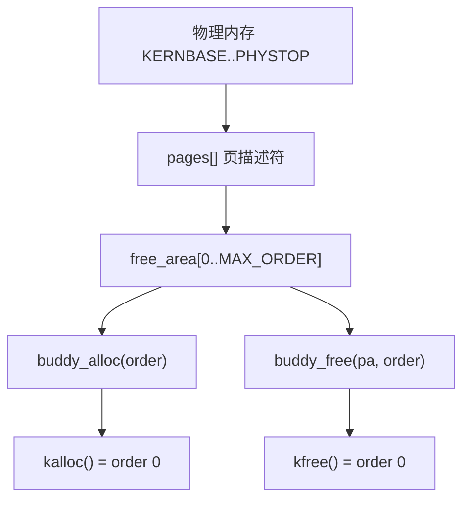
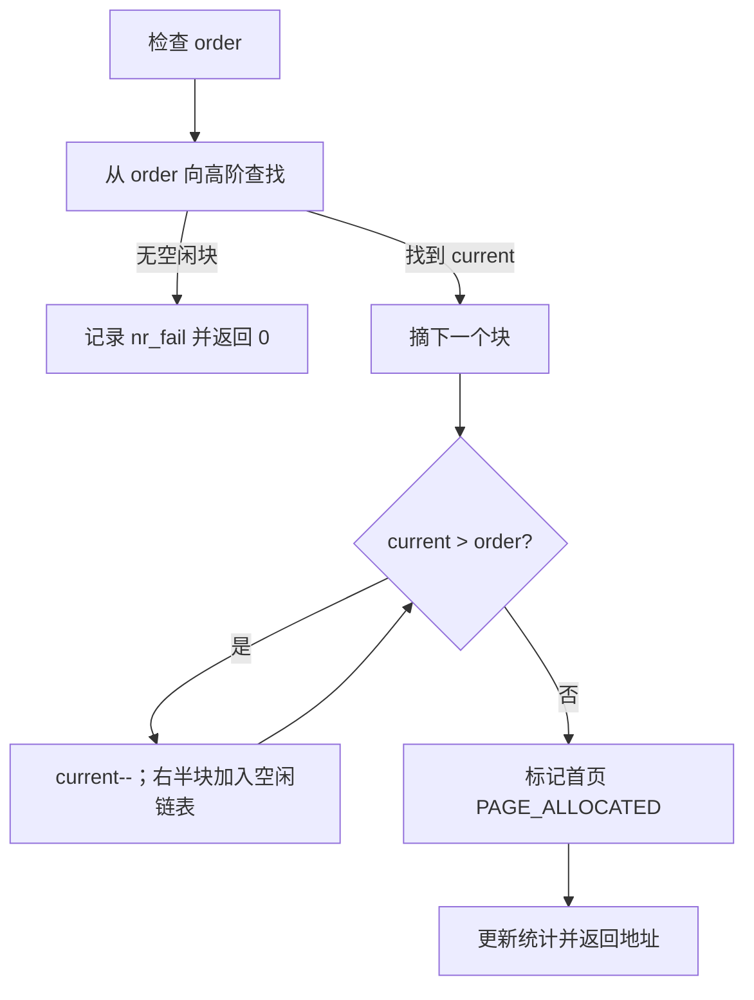

# xv6-riscv Buddy 物理页分配器修改指南

> 面向学习者的设计与实现文档  
> 目标分支：`mm-buddy-slab`  
> 基线仓库：<https://github.com/mit-pdos/xv6-riscv> 的 `riscv` 分支  
> 范围：只实现 Buddy，不实现 Slab，不修改文件系统

**文档状态（2026-09-14 更新）**：本文档最初是实现前的设计指南；实现与测试完成后，已补充“实际改动位置、核心代码、行号链接与测试记录”。文中代码均为 [`kernel/kalloc.c`](kernel/kalloc.c) 最终版本（422 行）的实际内容，链接格式为相对仓库根的 `文件#L行号` 锚点。

## 0. 实现速览

| 项目 | 内容 |
|---|---|
| 基线提交 | `9e3161a9abf5f51ea402562d1874caf6c4926597` |
| 实现分支 | `mm-buddy-slab` |
| 实际修改 | [`kernel/kalloc.c`](kernel/kalloc.c)（+383/-38）、[`kernel/defs.h`](kernel/defs.h#L59-L67)（+5） |
| 未修改 | `kernel/main.c`、`vm.c`、`proc.c`、`pipe.c`、文件系统与用户态 |
| Buddy 专项测试 | D1–D7 全部通过（含 order 0 耗尽 32476 页并完整恢复） |
| 预期 panic | E1–E6 全部触发预期 panic 文本（6 次独立启动） |
| 回归 | 3/3 轮 `usertests -q` 输出 `ALL TESTS PASSED`，`forktest`/`stressfs` 通过，无 panic |
| 测试补丁 | [`xv6-buddy-tests.patch`](xv6-buddy-tests.patch)（临时应用，测后已还原生产版 `kalloc.c`） |
| 提交状态 | 未 commit、未 push（按要求） |

各修改文件的作用：

| 文件 | 实际改动 | 作用 |
|---|---|---|
| [`kernel/kalloc.c`](kernel/kalloc.c) | 用 Buddy 元数据、空闲链表、初始化、分配/拆分、释放/合并、一致性检查替换原单页空闲链表 | 对外仍提供 `kalloc/kfree`，新增 `buddy_alloc/buddy_free` 及观测接口 |
| [`kernel/defs.h`](kernel/defs.h#L59-L67) | `// kalloc.c` 区域新增 5 个声明，保留原有 3 个 | 让其他内核文件可以看到 Buddy 接口 |
| `kernel/main.c` | 未修改 | 自测通过 `kalloc.c` 内的 `BUDDY_DEBUG` 条件编译触发，无需启动代码改动 |

调用关系（与改造前兼容）：

```text
kinit()  → 直接把 [PGROUNDUP(end), PHYSTOP) 按最大对齐块入各阶空闲链表（不再经过 kfree）
kalloc() → buddy_alloc(0)
kfree()  → buddy_free(pa, 0)
```

对应实现见 [`kinit()`](kernel/kalloc.c#L199-L254)、[`buddy_alloc()`](kernel/kalloc.c#L259-L304)、[`buddy_free()`](kernel/kalloc.c#L307-L366)、[`kalloc()`](kernel/kalloc.c#L371-L375)、[`kfree()`](kernel/kalloc.c#L380-L384)。

## 1. 实验目标

把 xv6 原来的“单页空闲链表”替换为简化的 Buddy 物理页分配器，同时保持原有接口兼容：

```c
void *kalloc(void);   // 仍然分配一个 4 KiB 页
void  kfree(void *);  // 仍然释放一个 4 KiB 页
```

实现中这两个函数只做转发，见 [`kalloc()`](kernel/kalloc.c#L371-L375) 和 [`kfree()`](kernel/kalloc.c#L380-L384)：

```c
void *
kalloc(void)
{
  return buddy_alloc(0);
}

void
kfree(void *pa)
{
  buddy_free(pa, 0);
}
```

新增可供后续 Slab 或实验代码使用的连续页接口：

```c
void *buddy_alloc(int order);
void  buddy_free(void *pa, int order);
```

其中：

| order | 页数 | 默认页大小下的字节数 |
| ---: | ---: | ---: |
| 0 | 1 | 4 KiB |
| 1 | 2 | 8 KiB |
| 2 | 4 | 16 KiB |
| 10 | 1024 | 4 MiB |
| 14 | 16384 | 64 MiB |

本实验不是移植完整 Linux Buddy。第一版明确不实现 zone、NUMA、GFP flags、迁移类型、per-CPU page list 和内存热插拔。实际实现同样遵循这一边界。

## 2. 为什么不需要改文件系统

原版 [`kernel/kalloc.c`](https://github.com/mit-pdos/xv6-riscv/blob/riscv/kernel/kalloc.c) 只向调用者提供整页分配。只要 `kalloc()` 和 `kfree()` 的语义不变，`vm.c`、`proc.c`、`pipe.c` 以及文件系统相关代码都不需要了解 Buddy。

以下文件保持未修改：

```text
kernel/fs.c
kernel/bio.c
kernel/log.c
kernel/file.c
kernel/sysfile.c
mkfs/
user/
```

`usertests` 会执行文件读写，因此 Buddy 错误可能表现成文件系统测试失败。这通常说明某个正在使用的物理页被错误合并、重复分配或覆盖，而不是需要修改文件系统。

本次实现的实际验证也证明了这一点：Buddy 改动只涉及 `kalloc.c` 与 `defs.h`，`usertests -q` 全部通过（见第 15 节）。

## 3. 修改前固定本地基线

先在仓库根目录执行：

```bash
git switch mm-buddy-slab
git status --short
git rev-parse HEAD
git branch --show-current
```

实际记录（本次实现）：

```text
分支：mm-buddy-slab
基线提交：9e3161a9abf5f51ea402562d1874caf6c4926597
工作区：仅有两个未跟踪文档（xv6-buddy-agent-task.md、xv6-buddy-implementation-guide.md）
```

要求：

1. 当前分支应为 `mm-buddy-slab`。
2. 记录 `git rev-parse HEAD` 的输出，作为实验基线。
3. 若工作区已有修改，先确认来源，不覆盖、不清理用户已有修改。
4. 先确认原版能够构建和启动，再开始替换分配器。

## 4. 原版分配路径与改造后路径

原版 `kalloc.c` 的结构很简单：

```text
kinit()
  └─ freerange(end, PHYSTOP)
       └─ 对每一页调用 kfree()
            └─ 插入 kmem.freelist

kalloc()
  └─ 从 kmem.freelist 取出一个页
```

它只能分配单页，也不会记录相邻空闲页是否可合并。Buddy 改造后的结构是：



实际改动中原有的 `freerange()` 与 `struct run`/`kmem` 已被删除，`kinit()` 直接按 order 分解空闲区，不再逐页走 `kfree()`。详见第 7 节。

## 5. 实际修改范围

### 5.1 文件级

实际只修改两个文件：

| 文件 | 修改内容 |
|---|---|
| [`kernel/kalloc.c`](kernel/kalloc.c) | Buddy 元数据、初始化、分配、拆分、释放、合并、检查与统计 |
| [`kernel/defs.h`](kernel/defs.h#L59-L67) | 增加 Buddy 调试和连续页接口声明 |

`kernel/main.c` 未修改：自测放在 `kalloc.c` 内并用 `#ifdef BUDDY_DEBUG` 保护，`kinit()` 末尾条件调用。

实际 `git diff --stat`：

```text
 kernel/defs.h   |   5 +
 kernel/kalloc.c | 416 ++++++++++++++++++++++++++++++++++++++++++++++++++------
 2 files changed, 383 insertions(+), 38 deletions(-)
```

### 5.2 函数级索引

`kernel/kalloc.c`（共 422 行）的实际内容索引：

| 名称 | 代码位置 | 作用 |
|---|---|---|
| `BUDDY_MAX_ORDER` / `BUDDY_NR_PAGES` | [`L12-L13`](kernel/kalloc.c#L12-L13) | 最大 order 与页描述符数组大小 |
| `enum page_state` | [`L18-L22`](kernel/kalloc.c#L18-L22) | 页状态：未使用/空闲/已分配 |
| `struct page` | [`L24-L29`](kernel/kalloc.c#L24-L29) | 每页描述符（双向链表指针 + order + state） |
| `struct free_area` | [`L31-L34`](kernel/kalloc.c#L31-L34) | 每阶空闲链表头和块数 |
| `pages[]` | [`L36`](kernel/kalloc.c#L36) | 静态页描述符数组（BSS） |
| `buddy` 全局状态 | [`L38-L49`](kernel/kalloc.c#L38-L49) | 锁、各阶链表、起点、空闲页数与统计 |
| `pa_to_index()` | [`L51-L55`](kernel/kalloc.c#L51-L55) | 物理地址 → 页索引（KERNBASE 基准） |
| `index_to_pa()` | [`L57-L61`](kernel/kalloc.c#L57-L61) | 页索引 → 物理地址 |
| `page_to_index()` | [`L63-L67`](kernel/kalloc.c#L63-L67) | 描述符 → 页索引 |
| `page_to_pa()` | [`L69-L73`](kernel/kalloc.c#L69-L73) | 描述符 → 物理地址 |
| `free_list_add()` | [`L77-L90`](kernel/kalloc.c#L77-L90) | 头插法加入空闲链表 |
| `free_list_del()` | [`L92-L109`](kernel/kalloc.c#L92-L109) | O(1) 摘除链表节点 |
| `buddy_check_locked()` | [`L112-L170`](kernel/kalloc.c#L112-L170) | 持锁一致性检查 |
| `buddy_selftest()` | [`L172-L197`](kernel/kalloc.c#L172-L197) | `BUDDY_DEBUG` 下的启动自测 |
| `kinit()` | [`L199-L254`](kernel/kalloc.c#L199-L254) | 初始化并按最大对齐块分解内存 |
| `buddy_alloc()` | [`L256-L304`](kernel/kalloc.c#L256-L304) | 按 order 分配并拆分 |
| `buddy_free()` | [`L306-L366`](kernel/kalloc.c#L306-L366) | 校验、poison 并按 buddy 合并释放 |
| `kalloc()` | [`L368-L375`](kernel/kalloc.c#L368-L375) | order 0 兼容包装 |
| `kfree()` | [`L377-L384`](kernel/kalloc.c#L377-L384) | order 0 兼容包装 |
| `buddy_check()` | [`L386-L395`](kernel/kalloc.c#L386-L395) | 加锁的公开检查 |
| `buddy_free_pages()` | [`L397-L406`](kernel/kalloc.c#L397-L406) | 加锁读取空闲页数 |
| `buddy_dump()` | [`L408-L422`](kernel/kalloc.c#L408-L422) | 打印各阶块数与统计 |

`kernel/defs.h` 的新增声明见 [`L59-L67`](kernel/defs.h#L59-L67)。

## 6. 核心设计

### 6.1 常量

原版 [`kernel/memlayout.h`](kernel/memlayout.h#L42-L44) 默认定义：

```c
#define KERNBASE 0x80000000L
#define PHYSTOP  (KERNBASE + 128 * 1024 * 1024)
```

实际在 [`kalloc.c:12-13`](kernel/kalloc.c#L12-L13) 定义：

```c
#define BUDDY_MAX_ORDER 14
#define BUDDY_NR_PAGES ((PHYSTOP - KERNBASE) / PGSIZE)
```

`order 14` 对应 64 MiB。它足以演示大块拆分与合并，又不会要求把整个 128 MiB 区间合并成一个 order 15 块。内核本身占用了 `KERNBASE` 后的一段空间，所以实际初始空闲区也不是完整的 128 MiB 块。

### 6.2 页描述符

每个物理页对应一个描述符。只有块的首页描述符表示一个有效块；块内部页保持 `PAGE_UNUSED`。实际代码见 [`kalloc.c:18-29`](kernel/kalloc.c#L18-L29)：

```c
enum page_state {
  PAGE_UNUSED = 0,
  PAGE_FREE,
  PAGE_ALLOCATED,
};

struct page {
  struct page *next;
  struct page *prev;
  short order;
  uchar state;
};
```

每阶空闲链表与全局状态见 [`kalloc.c:31-49`](kernel/kalloc.c#L31-L49)：

```c
struct free_area {
  struct page *head;
  uint64 nr_blocks;
};

static struct page pages[BUDDY_NR_PAGES];

static struct {
  struct spinlock lock;
  struct free_area area[BUDDY_MAX_ORDER + 1];
  uint64 managed_start;
  uint64 managed_first_index;
  uint64 free_pages;
  uint64 nr_alloc;
  uint64 nr_free;
  uint64 nr_split;
  uint64 nr_merge;
  uint64 nr_fail;
} buddy;
```

`BUDDY_NR_PAGES = 32768`，`sizeof(struct page)` 为 24 字节（两个指针 16 字节 + `short`/`uchar` 补齐），因此 `pages[]` 约占 768 KiB，位于 BSS。链接器符号 `end` 在 BSS 之后，所以初始化必须从 `PGROUNDUP((uint64)end)` 开始，不能从 `KERNBASE` 开始释放内存。实际计算见 [`kalloc.c:226-227`](kernel/kalloc.c#L226-L227)。

### 6.3 地址与索引

所有 Buddy 对齐和异或计算以 `KERNBASE` 为基准，实际代码见 [`kalloc.c:51-73`](kernel/kalloc.c#L51-L73)：

```c
static uint64
pa_to_index(uint64 pa)
{
  return (pa - KERNBASE) / PGSIZE;
}

static uint64
index_to_pa(uint64 index)
{
  return KERNBASE + index * PGSIZE;
}

static uint64
page_to_index(struct page *p)
{
  return (uint64)(p - pages);
}

static inline uint64
page_to_pa(struct page *p)
{
  return index_to_pa(page_to_index(p));
}
```

Buddy 页号公式：

```c
buddy_index = index ^ (1ULL << order);
```

不要直接写 `pa ^ block_size`，也不要以未经高阶对齐的 `end` 为异或基址。

实现说明：`page_to_pa()` 在最终代码中未被直接调用，但为保持任务规格要求的完整地址辅助函数集而保留；使用 `static inline` 声明是为了避免 `-Werror=unused-function` 导致构建失败（内核以 `-Wall -Werror` 编译）。

### 6.4 空闲链表

每个 order 维护一个双向链表。双向链表的原因是合并时必须以 O(1) 时间删除指定 buddy 块。实际代码见 [`kalloc.c:75-109`](kernel/kalloc.c#L75-L109)：

```c
// The free-list helpers below assume the caller holds buddy.lock,
// or that they are called single-threaded during kinit().
static void
free_list_add(struct page *p, int order)
{
  struct free_area *area = &buddy.area[order];

  p->state = PAGE_FREE;
  p->order = order;
  p->prev = 0;
  p->next = area->head;
  if (area->head)
    area->head->prev = p;
  area->head = p;
  area->nr_blocks++;
}

static void
free_list_del(struct page *p, int order)
{
  struct free_area *area = &buddy.area[order];

  if (p->prev)
    p->prev->next = p->next;
  else
    area->head = p->next;
  if (p->next)
    p->next->prev = p->prev;

  p->prev = 0;
  p->next = 0;
  p->state = PAGE_UNUSED;
  p->order = -1;
  area->nr_blocks--;
}
```

必须保持这些不变量：

- 链表中的页一定是块首页；
- `page->state == PAGE_FREE`；
- `page->order` 等于所在链表的 order；
- 地址相对 `KERNBASE` 满足 `2^order` 页对齐；
- `nr_blocks` 与实际链表节点数相等。

持锁约定由代码注释固定：`free_list_add/free_list_del` 的调用者必须持 `buddy.lock`，或处于 `kinit()` 的单 CPU 启动阶段。分配、释放、检查路径都在持锁状态下调用它们。

## 7. 初始化算法

原来的 `freerange()` 逐页调用 `kfree()`，不再适合作为 Buddy 初始化方式，因为新的 `buddy_free()` 应只接受之前由 Buddy 分配的块。实际实现中 `freerange()` 与 `struct run`/`kmem` 已删除，`kinit()` 见 [`kalloc.c:199-254`](kernel/kalloc.c#L199-L254)：

```c
void
kinit()
{
  uint64 first, limit, index;
  int order, i;

  initlock(&buddy.lock, "buddy");

  for (i = 0; i <= BUDDY_MAX_ORDER; i++) {
    buddy.area[i].head = 0;
    buddy.area[i].nr_blocks = 0;
  }

  buddy.free_pages = 0;
  buddy.nr_alloc = 0;
  buddy.nr_free = 0;
  buddy.nr_split = 0;
  buddy.nr_merge = 0;
  buddy.nr_fail = 0;

  for (i = 0; i < BUDDY_NR_PAGES; i++) {
    pages[i].next = 0;
    pages[i].prev = 0;
    pages[i].state = PAGE_UNUSED;
    pages[i].order = -1;
  }

  buddy.managed_start = PGROUNDUP((uint64)end);
  buddy.managed_first_index = pa_to_index(buddy.managed_start);
  first = buddy.managed_first_index;
  limit = pa_to_index(PHYSTOP);

  index = first;
  while (index < limit) {
    order = BUDDY_MAX_ORDER;

    while (order > 0) {
      uint64 npages = 1ULL << order;

      if ((index & (npages - 1)) == 0 && index + npages <= limit)
        break;
      order--;
    }

    free_list_add(&pages[index], order);
    buddy.free_pages += 1ULL << order;
    index += 1ULL << order;
  }

  if (!buddy_check_locked())
    panic("buddy init");

#ifdef BUDDY_DEBUG
  buddy_selftest();
#endif
}
```

步骤说明：

1. 初始化锁和所有 `free_area`（[`L205-L210`](kernel/kalloc.c#L205-L210)）。
2. 清零统计并设置全部描述符为 `PAGE_UNUSED`、`order = -1`（[`L212-L224`](kernel/kalloc.c#L212-L224)）。
3. 计算 `managed_start`、`managed_first_index` 和 `limit`（[`L226-L229`](kernel/kalloc.c#L226-L229)）。
4. 从 `first` 开始，每次选择“地址满足对齐、并且不会越过 limit”的最大 order（[`L231-L241`](kernel/kalloc.c#L231-L241)）。
5. 把块首页加入对应空闲链表、累计 `free_pages`、跳过整个块（[`L243-L245`](kernel/kalloc.c#L243-L245)）。
6. 用不加锁的 `buddy_check_locked()` 做一次一致性检查，失败即 `panic("buddy init")`（[`L248-L249`](kernel/kalloc.c#L248-L249)）。
7. `BUDDY_DEBUG` 下可选调用自测（[`L251-L253`](kernel/kalloc.c#L251-L253)）。

启动阶段只有主 CPU 执行 `kinit()`，因此内部操作可以直接调用不加锁的链表辅助函数；检查阶段调用的是不重复加锁的 `buddy_check_locked()`，不会死锁。

## 8. 分配与拆分

`buddy_alloc(order)` 的实际代码见 [`kalloc.c:259-304`](kernel/kalloc.c#L259-L304)：

```c
void *
buddy_alloc(int order)
{
  int current;
  uint64 index, pa;
  struct page *p;

  if (order < 0 || order > BUDDY_MAX_ORDER)
    return 0;

  acquire(&buddy.lock);

  for (current = order; current <= BUDDY_MAX_ORDER; current++)
    if (buddy.area[current].head)
      break;

  if (current > BUDDY_MAX_ORDER) {
    buddy.nr_fail++;
    release(&buddy.lock);
    return 0;
  }

  p = buddy.area[current].head;
  free_list_del(p, current);
  index = page_to_index(p);

  while (current > order) {
    current--;
    free_list_add(&pages[index + (1ULL << current)], current);
    buddy.nr_split++;
  }

  p->state = PAGE_ALLOCATED;
  p->order = order;
  p->prev = 0;
  p->next = 0;

  buddy.free_pages -= 1ULL << order;
  buddy.nr_alloc++;

  release(&buddy.lock);

  pa = index_to_pa(index);
  memset((void *)pa, 5, (uint64)PGSIZE << order); // fill with junk
  return (void *)pa;
}
```

流程：



关键点：

- 非法 order 直接返回 0（[`L266-L267`](kernel/kalloc.c#L266-L267)）。
- 从请求 order 向高阶扫描第一条非空链表；找不到时 `nr_fail++` 后返回 0（[`L271-L279`](kernel/kalloc.c#L271-L279)）。
- 拆分时右半块索引为 `index + 2^current`，左半块继续参与后续拆分；`nr_split++`（[`L285-L289`](kernel/kalloc.c#L285-L289)）。
- 最终只把返回块的首页标记为 `PAGE_ALLOCATED` 并记录请求 order（[`L291-L294`](kernel/kalloc.c#L291-L294)）。
- `free_pages -= 2^order`，`nr_alloc++`（[`L296-L297`](kernel/kalloc.c#L296-L297)）。
- 释放锁后把整个已分配块填充为 `5`（长度是 `PGSIZE << order`，不是固定一页），沿用 xv6 调试习惯（[`L301-L302`](kernel/kalloc.c#L301-L302)）。

## 9. 释放与合并

`buddy_free(pa, order)` 在修改状态前必须验证，实际代码见 [`kalloc.c:307-366`](kernel/kalloc.c#L307-L366)：

```c
void
buddy_free(void *pa, int order)
{
  uint64 index, buddy_index, npages;
  struct page *p, *bp;

  if (order < 0 || order > BUDDY_MAX_ORDER)
    panic("buddy_free order");
  if (pa == 0 || ((uint64)pa % PGSIZE) != 0)
    panic("buddy_free address");
  if ((uint64)pa < buddy.managed_start ||
      (uint64)pa + ((uint64)PGSIZE << order) > PHYSTOP)
    panic("buddy_free range");
  if ((((uint64)pa - KERNBASE) & (((uint64)PGSIZE << order) - 1)) != 0)
    panic("buddy_free alignment");

  acquire(&buddy.lock);

  index = pa_to_index((uint64)pa);
  p = &pages[index];
  if (p->state != PAGE_ALLOCATED)
    panic("buddy_free state");
  if (p->order != order)
    panic("buddy_free order mismatch");

  npages = 1ULL << order;

  // Poison before the block can re-enter a free list, while holding the
  // lock so that no free-list node can be overwritten concurrently.
  memset(pa, 1, (uint64)PGSIZE << order);

  p->prev = 0;
  p->next = 0;
  p->state = PAGE_UNUSED;
  p->order = -1;

  while (order < BUDDY_MAX_ORDER) {
    buddy_index = index ^ (1ULL << order);

    if (buddy_index < buddy.managed_first_index ||
        buddy_index + (1ULL << order) > BUDDY_NR_PAGES)
      break;

    bp = &pages[buddy_index];
    if (bp->state != PAGE_FREE || bp->order != order)
      break;

    free_list_del(bp, order);
    if (buddy_index < index)
      index = buddy_index;
    order++;
    buddy.nr_merge++;
  }

  free_list_add(&pages[index], order);
  buddy.free_pages += npages;
  buddy.nr_free++;

  release(&buddy.lock);
}
```

参数检查与失败原因：

| 检查 | panic 信息 | 说明 |
|---|---|---|
| order 在 `[0, BUDDY_MAX_ORDER]` | `buddy_free order` | 非法 order |
| 非空且按 `PGSIZE` 对齐 | `buddy_free address` | 未对齐或空指针 |
| 位于 `[managed_start, PHYSTOP)` 且块尾不越界 | `buddy_free range` | 非法地址范围 |
| 相对 `KERNBASE` 满足 `2^order` 对齐 | `buddy_free alignment` | 高阶块的首页对齐 |
| 锁内首页为 `PAGE_ALLOCATED` | `buddy_free state` | 重复释放或释放块内部地址 |
| 锁内记录的 order 等于传入 order | `buddy_free order mismatch` | wrong-order free |

非法地址、重复释放、释放块内部地址或 wrong-order free 都会触发 panic，不会静默接受。

合并流程：

1. 先做范围/对齐等不需持锁的检查，再取锁做状态与 order 校验（[`L313-L330`](kernel/kalloc.c#L313-L330)）。
2. `npages = 2^order` 保存原始释放页数（[`L332`](kernel/kalloc.c#L332)）。
3. 在锁内、块重新进入空闲链表之前，用 `1` poison 整个块（[`L334-L336`](kernel/kalloc.c#L334-L336)）。第一版允许为保证正确性在 Buddy 锁内执行 poison，实现简单且不存在空闲链表节点被覆盖的竞态。
4. 将当前头描述符重置为未挂链状态（[`L338-L341`](kernel/kalloc.c#L338-L341)）。
5. 当 `order < BUDDY_MAX_ORDER` 时计算 `buddy_index = index ^ 2^order`；buddy 必须完整位于受管范围内，且其首页为同阶 `PAGE_FREE`，才能合并（[`L343-L352`](kernel/kalloc.c#L343-L352)）。
6. 从该阶链表删除 buddy，选择两个索引中较小者作为新块首页，order 增加，继续尝试（[`L354-L358`](kernel/kalloc.c#L354-L358)）。
7. 最终块加入相应空闲链表（[`L361`](kernel/kalloc.c#L361)）。
8. `free_pages` 只增加原始释放块的 `npages`；每次合并不得重复增加（[`L362-L363`](kernel/kalloc.c#L362-L363)）。

## 10. 保持兼容接口

`kalloc()` 和 `kfree()` 只做转发（[`kalloc.c:371-384`](kernel/kalloc.c#L371-L384)）：

```c
void *
kalloc(void)
{
  return buddy_alloc(0);
}

void
kfree(void *pa)
{
  buddy_free(pa, 0);
}
```

这条兼容边界非常重要：现有 `vm.c`、`proc.c`、`pipe.c`、`sysfile.c`、`virtio_disk.c` 等调用者没有为 Buddy 做任何修改。实际核对结果（实现后 grep）：

```text
kernel/proc.c        kalloc()/kfree()
kernel/pipe.c        kalloc()/kfree()
kernel/vm.c          kalloc()/kfree()
kernel/sysfile.c     kalloc()/kfree()
kernel/virtio_disk.c kalloc()
```

它们全部继续使用单页语义。

## 11. 对外声明

在 [`kernel/defs.h`](kernel/defs.h#L59-L67) 的 `// kalloc.c` 区域保留原声明，并增加 5 行：

```c
// kalloc.c
void*           kalloc(void);
void            kfree(void *);
void            kinit(void);
void*           buddy_alloc(int);
void            buddy_free(void *, int);
int             buddy_check(void);
void            buddy_dump(void);
uint64          buddy_free_pages(void);
```

没有增加系统调用。状态查看通过内核调试函数完成。

## 12. 一致性检查

实际实现内部函数 `buddy_check_locked()`（[`kalloc.c:112-170`](kernel/kalloc.c#L112-L170)）以及获得锁的公开包装 `buddy_check()`（[`kalloc.c:386-395`](kernel/kalloc.c#L386-L395)）：

```c
// Caller must hold buddy.lock.
static int
buddy_check_locked(void)
{
  uint64 total = 0;
  int order;

  for (order = 0; order <= BUDDY_MAX_ORDER; order++) {
    struct free_area *area = &buddy.area[order];
    struct page *prev = 0;
    struct page *p = area->head;
    uint64 count = 0;
    uint64 npages = 1ULL << order;

    while (p) {
      uint64 index;

      if (count >= BUDDY_NR_PAGES)
        return 0;
      if (p < pages || p >= &pages[BUDDY_NR_PAGES])
        return 0;

      index = page_to_index(p);

      if (p->state != PAGE_FREE || p->order != order)
        return 0;
      if (p->prev != prev)
        return 0;
      if ((index & (npages - 1)) != 0)
        return 0;
      if (index < buddy.managed_first_index ||
          index + npages > BUDDY_NR_PAGES)
        return 0;

      // Two free buddies of the same order should have been merged.
      if (order < BUDDY_MAX_ORDER) {
        uint64 bi = index ^ (1ULL << order);
        if (bi >= buddy.managed_first_index &&
            bi + npages <= BUDDY_NR_PAGES) {
          struct page *bp = &pages[bi];
          if (bp->state == PAGE_FREE && bp->order == order)
            return 0;
        }
      }

      total += npages;
      count++;
      prev = p;
      p = p->next;
    }

    if (count != area->nr_blocks)
      return 0;
  }

  if (total != buddy.free_pages)
    return 0;

  return 1;
}
```

检查内容与任务规格对应：

1. 节点位于 `pages[]` 内（先做边界检查，再做 `page_to_index()` 指针运算），[`L128-L133`](kernel/kalloc.c#L128-L133)。
2. `state` 为 `PAGE_FREE`，`order` 与链表一致（[`L135-L136`](kernel/kalloc.c#L135-L136)）。
3. `prev/next` 关系正确（[`L137-L138`](kernel/kalloc.c#L137-L138)）。
4. 地址满足 order 对齐（[`L139-L140`](kernel/kalloc.c#L139-L140)）。
5. 块位于受管区且不越界（[`L141-L143`](kernel/kalloc.c#L141-L143)）。
6. `order < BUDDY_MAX_ORDER` 时不存在可继续合并的一对同阶空闲 buddy（[`L145-L154`](kernel/kalloc.c#L145-L154)）。
7. 实际节点数等于每阶 `nr_blocks`（[`L162-L163`](kernel/kalloc.c#L162-L163)）。
8. 加权空闲页数等于 `free_pages`（[`L166-L167`](kernel/kalloc.c#L166-L167)）。
9. 每条链表遍历次数不超过 `BUDDY_NR_PAGES`，防止链表环死循环（[`L128-L129`](kernel/kalloc.c#L128-L129)）。

公开函数自行获取 Buddy 锁（[`buddy_check()` L386-L395](kernel/kalloc.c#L386-L395)、[`buddy_free_pages()` L397-L406](kernel/kalloc.c#L397-L406)、[`buddy_dump()` L408-L422](kernel/kalloc.c#L408-L422)）。内部持锁路径只调用 `buddy_check_locked()`，避免递归加锁。

观测接口实际输出样例（`buddy_dump()`）：

```c
buddy: order %d: %ld blocks
buddy: free %ld pages, alloc %ld free %ld split %ld merge %ld fail %ld
```

打印格式使用本仓库 `printk` 支持的 `%d`/`%ld`（见 [`kernel/printk.c:86-101`](kernel/printk.c#L86-L101)），不产生格式告警。

## 13. 自测

自测位于 [`kalloc.c:172-197`](kernel/kalloc.c#L172-L197)，用宏控制：

```c
#ifdef BUDDY_DEBUG
static void
buddy_selftest(void)
{
  uint64 before = buddy.free_pages;
  void *a, *b, *c;

  a = buddy_alloc(0);
  b = buddy_alloc(0);
  c = buddy_alloc(2);
  if (a == 0 || b == 0 || c == 0)
    panic("buddy selftest alloc");
  if ((((uint64)c - KERNBASE) & ((PGSIZE << 2) - 1)) != 0)
    panic("buddy selftest align");

  buddy_free(c, 2);
  buddy_free(a, 0);
  buddy_free(b, 0);

  if (!buddy_check())
    panic("buddy selftest check");
  if (buddy.free_pages != before)
    panic("buddy selftest leak");
  printk("buddy: selftest passed\n");
}
#endif
```

自测覆盖：保存初始空闲页数 → 申请两个 order 0 和一个 order 2 块 → 验证 order 2 相对 `KERNBASE` 的对齐 → 按不同顺序释放 → `buddy_check()` → 验证空闲页数完全恢复。

在 `kinit()` 末尾条件调用（[`L251-L253`](kernel/kalloc.c#L251-L253)）。`kinit()` 阶段尚未持锁，且调用的是会自行加锁的公开 `buddy_check()`，不会重复加锁。

实际启用方式（最终提交状态不包含调试代码）：

1. 临时在 `kalloc.c` 顶部（`BUDDY_MAX_ORDER` 之前）加入 `#define BUDDY_DEBUG 1`。
2. `make kernel/kernel` 重新编译内核。
3. 启动 qemu，观察串口输出。
4. 验证完成后删除该行并重新构建，确保正式内核不含自测路径。

没有在 `Makefile` 中提供 `BUDDY_DEBUG` 开关，因此实际测试采用的是上述“临时定义再还原”的方式；最终源码中只保留 `#ifdef BUDDY_DEBUG`，编译时不会进入正式路径。

完整专项测试套件（D1–D7 与 E1–E6）不长期保留在正式源码中，而是单独保存在 [`xv6-buddy-tests.patch`](xv6-buddy-tests.patch)。该补丁在 `#ifdef BUDDY_DEBUG` 内把 `buddy_selftest()` 扩展为依次执行 D7→D1→…→D6，并在文件末尾追加实现与 `#ifdef BUDDY_PANIC_CASE` 用例；测试完成后 `kernel/kalloc.c` 已还原为当前生产版本（`sha256sum` 与备份一致）。启用方式：

```bash
patch -p1 < xv6-buddy-tests.patch
make clean
make DETFLAGS="-ffile-prefix-map=$(pwd)=. -DBUDDY_DEBUG"   # D 套件
make fs.img
# E 用例 N=1..6（只需重编 kalloc.o）：
rm -f kernel/kalloc.o kernel/kernel
make DETFLAGS="-ffile-prefix-map=$(pwd)=. -DBUDDY_PANIC_CASE=N"
patch -R -p1 < xv6-buddy-tests.patch                        # 还原生产版
```

`DETFLAGS` 被 Makefile 追加进 `CFLAGS`（[`Makefile:64`](Makefile#L64)、[`Makefile:67`](Makefile#L67)），因此无需修改源码即可注入宏；切换变体前必须 `make clean`，因为 make 不跟踪编译选项变化。

## 14. 实现要点与设计取舍

1. **元数据规模**：`pages[BUDDY_NR_PAGES]` 静态放在 BSS，约 768 KiB；`end` 在其后，因此 `managed_start` 天然避开内核镜像与元数据。
2. **对齐基准**：所有 order 对齐与 buddy 异或都以 `KERNBASE` 对应的页索引 0 为基准，不用 `end` 或 `managed_start` 做基址。
3. **拆分方向**：始终保留低地址左半块继续拆分，右半块入低一阶链表；最终块首页就是 `index`。
4. **合并方向**：合并后选择两个索引中较小者，保证合并块首页地址单调不增。
5. **统计口径**：`free_pages` 表示“实际空闲页数”；拆分不改变它，只有分配时扣除请求页数；合并不改变它，只有释放时增加原块页数。
6. **poison 位置**：`buddy_alloc()` 的 `5` 填充在释放锁之后；`buddy_free()` 的 `1` 填充在锁内、入链表之前。代价是锁内大块 `memset` 会拉长临界区，收益是无需引入 `PAGE_FREEING` 状态即可保证正确性。
7. **校验顺序**：`buddy_free()` 先做不需要状态的范围/对齐检查，再取锁检查 `PAGE_ALLOCATED` 与 order；非法释放不会先破坏内存。
8. **检查器健壮性**：`buddy_check_locked()` 先做数组边界检查，再对指针做减法；每条链表有遍历上限，防止坏链造成死循环。
9. **`page_to_pa()` 保留**：规格要求完整的地址辅助函数集，但实现中未直接使用；用 `static inline` 避免 `-Werror=unused-function`。
10. **不拆分文件**：实现放在 `kalloc.c`，避免改 `Makefile`，也符合“Buddy 是原物理页分配器的替代品”这一分层。

## 15. 构建与回归验证（实际执行记录）

### 15.1 测试方法

- 构建：`make clean && make`（内核以 `-Wall -Werror` 编译）。
- 运行：使用 `/tmp/opencode/xv6_run.py`（Python + pexpect）自动启动 qemu、等待 `init: starting sh`、发送命令并读取输出，最后以 `Ctrl-A x` 正常退出 QEMU。qemu 参数与 `make qemu` 一致：

  ```text
  qemu-system-riscv64 -machine virt -bios none -kernel kernel/kernel \
    -m 128M -smp 3 -nographic -global virtio-mmio.force-legacy=false \
    -drive file=fs.img,if=none,format=raw,id=x0 \
    -device virtio-blk-device,drive=x0,bus=virtio-mmio-bus.0
  ```

- 专项测试：临时应用 [`xv6-buddy-tests.patch`](xv6-buddy-tests.patch) 注入 D1–D7 与 E1–E6，用 `DETFLAGS` 选择变体；测完还原生产版 `kalloc.c` 并校验 `sha256sum`。
- panic 用例：`/tmp/opencode/xv6_panic.py` 匹配 `panic: <msg>` 后按 `Ctrl-A x` 退出，一次启动只跑一个用例。
- 日志：构建日志 `build-*.log`，专项日志 `D-selftest.log`、`E1.log`–`E6.log`，回归日志 `G-round1.log`–`G-round3.log`，目录 `/tmp/opencode/buddy-tests/`。
- 静态检查：`git diff --check`、`git diff --stat`、`git status --short`。

### 15.2 结果

| 验证项 | 结果 | 证据 |
|---|---|---|
| `git diff --check` | PASS | 无空白错误，退出码 0 |
| `make clean && make` | PASS | 无新增 warning、无链接错误 |
| 启动到 shell | PASS | 串口出现 `init: starting sh`，无 panic |
| Buddy 专项 D1–D7 | PASS | `D-selftest.log`，详见 15.3 |
| 预期 panic E1–E6 | PASS | 6 个用例 panic 文本与预期完全一致，详见 15.4 |
| 生产版 `BUDDY_DEBUG` 自测 | PASS | 历史记录 `buddy: selftest passed` |
| `usertests -q` | PASS | 3/3 轮 `ALL TESTS PASSED` |
| `forktest` / `stressfs` | PASS | 每轮 `fork test OK`，stressfs 正常返回 |
| `echo buddy-ok` / `ls` / `cat README` | PASS | 每轮输出正常 |
| 重复启动 | PASS | 3/3 轮，详见 15.5 |
| 改动范围 | PASS | 仅 `kernel/kalloc.c`、`kernel/defs.h`，`main.c` 未改 |

说明：

- 专项输出只在 `BUDDY_DEBUG` 变体中出现；生产版二进制中 `strings kernel/kernel | grep selftest` 为 0 条。
- `usertests -q` 在 3 轮重复启动中均完整通过。
- `fs.img`、`kernel/kernel` 等为构建产物，未纳入版本控制；本次未 commit、未 push。

### 15.3 Buddy 专项测试记录（D1–D7）

`BUDDY_DEBUG` 变体单次启动的实际串口输出：

```text
buddy: D7 ok (invalid order not counted in nr_fail)
buddy: D1 ok
buddy: D2 ok
buddy: D3 ok
buddy: D4 ok
buddy: D5 ok (0 alloc failures)
buddy: D6 ok (32476 pages)
buddy: all selftests passed, free pages 32476
```

| 用例 | 内容 | 结果 |
|---|---|---|
| D1 | 2×order0 + 1×order2，三者不重叠、计数 `before-6`、乱序释放恢复 | PASS |
| D2 | order 0..14 全部尝试，成功者对齐校验并原阶释放，每轮计数恢复 + check | PASS |
| D3 | order3→order0 拆分、乱序释放、重新合并并可再次进行 order3 分配 | PASS |
| D4 | 16 页三组释放顺序（奇→偶、高→低、固定伪随机） | PASS |
| D5 | 256 项记录表、order 0..5、5000 次确定性伪随机压力，0 次分配失败 | PASS |
| D6 | order 0 耗尽至 0，成功分配数 == 初始空闲页数 32476，逆序释放完整恢复 | PASS |
| D7 | 非法 order 返回 0 且 `free_pages`/`nr_fail` 不变（实现约定：不计入 `nr_fail`） | PASS |

### 15.4 预期 panic 记录（E1–E6）

| 用例 | 触发操作 | 实际 panic 文本 | 结果 |
|---|---|---|---|
| E1 | 同一 order 0 块释放两次 | `panic: buddy_free state` | PASS |
| E2 | order 2 块按 order 1 释放 | `panic: buddy_free order mismatch` | PASS |
| E3 | order 2 块内部地址（+PGSIZE）释放 | `panic: buddy_free alignment` | PASS |
| E4 | order 0 地址 +1 释放 | `panic: buddy_free address` | PASS |
| E5a | `managed_start - PGSIZE` 释放 | `panic: buddy_free range` | PASS |
| E5b | `PHYSTOP` 释放 | `panic: buddy_free range` | PASS |

所有用例均在写内存（poison）之前 panic，验证了 `buddy_free()` 的校验顺序。

### 15.5 重复启动记录（G）

生产版二进制连续 3 轮，每轮执行 `echo buddy-ok`、`ls`、`cat README`、`forktest`、`stressfs`、`usertests -q`：

| 轮次 | `usertests -q` | `forktest` | `stressfs` | panic | 结果 |
|---|---|---|---|---|---|
| 1 | `ALL TESTS PASSED` | `fork test OK` | 正常返回 | 无 | PASS |
| 2 | `ALL TESTS PASSED` | `fork test OK` | 正常返回 | 无 | PASS |
| 3 | `ALL TESTS PASSED` | `fork test OK` | 正常返回 | 无 | PASS |

专项测试前后 `free_pages` 均为 32476，无泄漏。

### 15.6 复现步骤

```bash
make clean && make && make fs.img     # 生产版构建
make qemu                             # 进入 shell 后执行 usertests -q
```

复现专项测试：

```bash
patch -p1 < xv6-buddy-tests.patch
make clean && make DETFLAGS="-ffile-prefix-map=$(pwd)=. -DBUDDY_DEBUG" && make fs.img
make qemu                             # D1–D7 自测在 kinit 阶段输出
patch -R -p1 < xv6-buddy-tests.patch  # 还原生产版
```

## 16. 推荐提交顺序

实现已完成但按要求未提交。若后续要提交，每个提交都应可构建，可参考：

```text
mm: add buddy page metadata and free areas
mm: initialize aligned buddy blocks
mm: implement buddy allocation and splitting
mm: implement buddy freeing and merging
mm: route kalloc and kfree through buddy
mm: add buddy consistency checks
```

若希望减少中间状态，可以合并为三个提交：元数据与初始化、分配释放、测试检查。

## 17. 常见错误与本次规避方式

| 错误 | 结果 | 本次实现如何规避 |
|---|---|---|
| 用 `end` 作为异或基址 | 高阶块对齐关系错误 | 异或只使用 `KERNBASE` 页索引，见 [`L344`](kernel/kalloc.c#L344) |
| 初始化仍逐页调用新的 `kfree()` | 新 `kfree()` 会把未分配页判为非法 | 删除 `freerange()`，`kinit()` 直接分解入链，见 [`L231-L246`](kernel/kalloc.c#L231-L246) |
| 使用单链表 | 合并时删除指定 buddy 需要线性扫描 | 双向链表 `prev/next`，见 [`free_list_del()`](kernel/kalloc.c#L92-L109) |
| 只检查页对齐，不检查 order 对齐 | 接受非法高阶块首地址 | `buddy_free()` 用 `2^order` 掩码检查，见 [`L320-L321`](kernel/kalloc.c#L320-L321) |
| 合并时不从旧链表删除 buddy | 同一物理页可能被重复分配 | 合并前 `free_list_del(bp, order)`，见 [`L354`](kernel/kalloc.c#L354) |
| 合并后不取较小索引 | 合并块首页错误 | `if (buddy_index < index) index = buddy_index`，见 [`L355-L356`](kernel/kalloc.c#L355-L356) |
| 每次合并都增加 `free_pages` | 空闲页统计虚增 | 只加一次 `npages`，见 [`L362`](kernel/kalloc.c#L362) |
| 在合法性检查前 poison | 非法/重复释放会先破坏仍在使用的数据 | 锁内先验证 `PAGE_ALLOCATED`/order，再 poison，见 [`L327-L336`](kernel/kalloc.c#L327-L336) |
| 在持锁状态调用公开 `buddy_check()` | 同一 CPU 重复获取自旋锁 | 内部只用 `buddy_check_locked()`，公开包装自行加锁，见 [`L386-L395`](kernel/kalloc.c#L386-L395) |
| 修改 `vm.c` 或文件系统适配 Buddy | 破坏分层边界并扩大调试范围 | 仅改 `kalloc.c`/`defs.h`，`kalloc/kfree` 保持不变 |

## 18. 完成标准

- [x] `kalloc()`/`kfree()` 的单页语义不变。
- [x] `buddy_alloc(0..14)` 能按可用内存情况分配对齐连续页。
- [x] `buddy_free()` 能正确合并同阶 buddy。
- [x] 重复释放、错误 order、未对齐地址会触发明确 panic。
- [x] 自测后空闲页数恢复。
- [x] Buddy 专项 D1–D7 通过（对齐、拆分合并、混合压力、order 0 耗尽与恢复）。
- [x] 预期 panic E1–E6 全部触发正确 panic 文本。
- [x] xv6 能启动进入 shell。
- [x] `usertests -q` 3/3 轮全部通过，`forktest`/`stressfs` 通过。
- [x] diff 只包含批准的内存分配器相关文件。
- [x] 文件系统、磁盘格式、系统调用接口均未修改；测试代码已从生产源码还原。
- [x] 未提交、未 push（按要求）。

## 19. 参考源码

本仓库（实际实现）：

- 物理页分配器：[`kernel/kalloc.c`](kernel/kalloc.c)（核心函数见 [5.2 函数级索引](#52-函数级索引)）
- 内核声明：[`kernel/defs.h:59-67`](kernel/defs.h#L59-L67)
- 物理内存布局：[`kernel/memlayout.h:42-44`](kernel/memlayout.h#L42-L44)
- `printk` 支持格式：[`kernel/printk.c:86-127`](kernel/printk.c#L86-L127)
- 测试补丁（D1–D7 与 E1–E6，可按需应用/还原）：[`xv6-buddy-tests.patch`](xv6-buddy-tests.patch)
- 测试相关文档：[`xv6-buddy-agent-task.md`](xv6-buddy-agent-task.md)、[`xv6-buddy-agent-test-plan.md`](xv6-buddy-agent-test-plan.md)

上游参考：

- [MIT xv6-riscv 仓库](https://github.com/mit-pdos/xv6-riscv)
- [原版物理页分配器 `kernel/kalloc.c`](https://github.com/mit-pdos/xv6-riscv/blob/riscv/kernel/kalloc.c)
- [物理内存布局 `kernel/memlayout.h`](https://github.com/mit-pdos/xv6-riscv/blob/riscv/kernel/memlayout.h)
- [内核声明 `kernel/defs.h`](https://github.com/mit-pdos/xv6-riscv/blob/riscv/kernel/defs.h)
