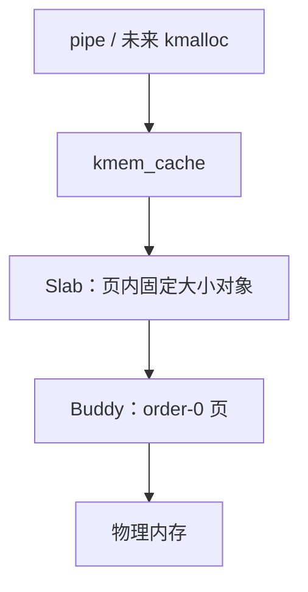

# xv6 Slab 必要完善计划

> 仓库：`Mina1insky/xv6-riscv`
>
> 目标分支：`slab-dev`
>
> 对照基线：`mm-buddy-slab` @ `6eb4dad204f948cbe7a769c8ac0a89fda2e4d367`
>
> 文档目的：在不推倒现有实现、不涉及文件系统的前提下，把当前教学型 Slab 收尾到可作为通用 `kmalloc` 上层基础的状态。

## 1. 结论

当前 Slab 核心机制已经成立，不需要重新设计：

- Slab 只向 Buddy 请求和归还 order-0 页；
- 每个 cache 管理固定大小对象；
- 每个 slab 占一页，页首保存元数据；
- 空闲对象使用对象内嵌 freelist；
- 位图用于识别重复释放并交叉检查 freelist；
- slab 在 `free / partial / full` 三条双向链表之间迁移；
- 空闲 cache 会把所有页还给 Buddy；
- `struct pipe` 已经是第一个真实使用者；
- 已有 T1～T6、自定义 panic 用例、pipe 压力和 `usertests` 验证记录。

因此，本计划不是“再实现一次 Slab”，而是修复一个确定的测试问题、补齐 cache 生命周期、增强回归测试并冻结接口。

## 2. 当前仓库进度

`slab-dev` 相对 `mm-buddy-slab` ahead 4 个提交，涉及：

| 文件 | 当前作用 |
|---|---|
| `kernel/slab.c` | Slab 核心、检查器、自测、故障注入 |
| `kernel/defs.h` | Slab 对外接口 |
| `kernel/main.c` | 在 `kinit()` 后执行 `slabinit()`，启动后创建 pipe cache |
| `kernel/pipe.c` | 用 pipe cache 分配和释放 `struct pipe` |
| `Makefile` | 链接 `kernel/slab.o` |
| `xv6-slab-implementation-guide.md` | 当前实现与历史验证记录 |

当前分层保持为：



## 3. 完善范围

### 必须完成

1. 修复 T2 自测中的未初始化指针读取。
2. 明确并实现 cache 描述符的回收策略，避免固定 `caches[16]` 被测试或未来扩展永久耗尽。
3. 为 cache 生命周期增加对应的正确性检查和测试。
4. 重新验证 Slab、Buddy、pipe 与原 xv6 回归测试。
5. 更新实现文档，使代码、测试结论和限制保持一致。

### 本轮不做

- 不实现通用 `kmalloc/kfree`；它是本计划完成后的下一阶段。
- 不实现 `vmalloc/vfree`。
- 不迁移 `file`、`inode`、`buf`、`proc` 等对象。
- 不修改文件系统、磁盘格式、页表格式或用户 ABI。
- 不加入 NUMA、zone、per-CPU cache、后台回收、对象构造器或多页 slab。
- 不重构已经有效的 `free/partial/full` 状态机。
- 不为了形式上的“无嵌套锁”重写 `slab_grow_locked()`；当前固定顺序 `cache->lock -> buddy.lock` 可继续使用，但必须写入注释和文档。

## 4. P0：修复确定的 T2 自测问题

### 问题

`slab_test_basic()` 当前代码：

```c
if (i > 0 && (p[0] == p[1] || p[0] == p[2] || p[1] == p[2]))
  panic("slab test t2 distinct");
```

当 `i == 1` 时，`p[2]` 尚未赋值，表达式可能读取未初始化的局部变量。这是测试代码缺陷，不代表 Slab 分配器本身错误，但会让测试结果依赖栈上的旧数据。

### 修改

在 `kernel/slab.c` 中改为只比较已经成功分配的对象：

```c
int j;

for (j = 0; j < i; j++)
  if (p[i] == p[j])
    panic("slab test t2 distinct");
```

### 验收

- `SLAB_SELFTEST` 构建无 warning；
- T2 稳定通过；
- 不改变生产路径和分配器行为。

建议提交：

```text
test: avoid uninitialized pointer reads in slab T2
```

## 5. P1：补齐 cache 生命周期

### 为什么需要

当前 `kmem_cache_create()` 从固定 `caches[16]` 中占用一个槽，但没有释放描述符的接口。生产构建目前只有 `pipe_cache`，所以现状不会立即出错；然而 `SLAB_SELFTEST` 会创建多个永久 cache，未来再初始化 8 个左右的 `kmalloc` size-class cache 时，调试构建可能比生产构建更早耗尽槽位。

这属于“当前功能能跑，但扩展接口未闭环”，应在通用 `kmalloc` 之前解决。

### 推荐接口

在 `kernel/defs.h` 增加：

```c
int kmem_cache_destroy(struct kmem_cache *cache);
```

返回规则：

- 成功返回 `0`；
- cache 为空、未激活或仍有 live object 时返回 `-1`；
- 不用 panic 表示正常的“仍在使用，不能销毁”；
- 非法内部状态仍然 panic，避免掩盖损坏。

### 使用约束

第一版将 `kmem_cache_destroy()` 定义为静态生命周期接口：调用者必须保证此时没有其他 CPU 正在对该 cache 执行 alloc/free。它主要用于启动期自测和未来显式卸载的 cache，不尝试实现 Linux 模块卸载级别的并发销毁。

必须把这个约束写在函数注释和文档中。不要声称它支持与 alloc/free 并发执行。

### 实现步骤

1. 验证 `cache != 0`、`cache->used` 和 `slab_ready`。
2. 获取 `cache->lock`。
3. 要求：
   - `live_objects == 0`；
   - `partial.count == 0`；
   - `full.count == 0`。
4. 摘除所有 `free` slab，清除 magic；释放 cache 锁后逐页调用 `buddy_free(page, 0)`。
5. 在 `caches_lock` 保护下清空描述符，并最后将 `used = 0`，使槽位可复用。
6. 不在持有 `caches_lock` 时进入 Buddy。

实现时应避免把多个待回收页存在动态数组里。可以一次摘一页、锁外归还，最后释放描述符；调用者的静态生命周期约束保证不会出现并发重新使用。

### 自测改造

- 每个 T1～T6 创建的临时 cache 在对象全部释放后执行 `kmem_cache_destroy()`；
- T1 检查销毁后 `slab_test_used_slots()` 回到测试前值；
- 增加 cache 槽复用测试：连续创建、销毁超过 `KMEM_CACHE_MAX` 次，不能耗尽槽位；
- 增加“有 live object 时 destroy 返回失败”的测试，随后释放对象再成功销毁；
- selftest 结束时要求只剩真实的长期 cache；由于 `pipeinit()` 在 selftest 之后执行，启动期 selftest 结束应为 0 个已用槽。

建议提交：

```text
mm: add quiescent slab cache destruction
test: cover slab cache reuse and busy destruction
```

## 6. P1：固定并检查并发规则

### 继续采用的锁顺序

```text
caches_lock
cache->lock -> buddy.lock
```

规则：

- `caches_lock` 只保护 cache 槽的创建、销毁和枚举；
- `cache->lock` 保护单个 cache 的 slab 链表、freelist、位图和统计；
- 增长 slab 时允许持有 `cache->lock` 调用 `buddy_alloc(0)`；
- 回收 slab 时必须先从 cache 链表摘除并释放 `cache->lock`，再调用 `buddy_free()`；
- Buddy 不得反向调用 Slab；
- 不允许持有 `buddy.lock` 再获取 `cache->lock`。

### 检查项

- 检查 `kmem_cache_free()`、`kmem_cache_shrink()` 和新增 destroy 的所有页归还路径；
- 归还 Buddy 后不得再读取 slab 页头；
- 检查错误路径是否成对释放锁；
- 对 `cache->used` 的读取要符合生命周期约束。若新增 destroy 后仍在无锁区读取 `used`，必须在注释中说明仅支持静态/静默销毁；不要把它包装成完全并发安全。

本阶段不要求修改锁结构。只有测试证明存在死锁或竞态时，才重构 grow 路径。

## 7. P1：增强必要测试

在保留 T1～T6 和 P1～P5 的基础上增加：

| 用例 | 验证内容 | 通过条件 |
|---|---|---|
| T7 cache lifecycle | busy destroy、正常 destroy、槽复用 | used 槽数恢复，Buddy 页数恢复 |
| T8 boundary layout | 接近单页上限、不同对齐值 | 创建成功/失败与布局公式一致，不越页 |
| T9 repeated grow/reap | 多轮跨 slab 分配、乱序释放 | 每轮 `grow/reap` 平衡，check 通过 |
| C1 pipe concurrency | 多进程反复 pipe/fork/close/read/write | 无 panic、hang、UAF，live 回 0 |
| C2 multi-hart repeat | 默认 `CPUS=3` 连续冷启动 | `usertests -q` 连续 3 次通过 |

### 边界测试建议

至少覆盖：

- size：1、15、16、17、24、64、512、1024；
- align：0、8、16、64、`PGSIZE`；
- 非 2 的幂对齐应失败；
- 无法在一页内放下一个对象应失败且不占 cache 槽；
- 所有返回对象满足 `addr % align == 0`；
- 对象最后一个字节可写且不覆盖下一对象或 slab header。

### 故障测试继续保留

- double free；
- wrong cache；
- interior pointer；
- 把原始 Buddy 页交给 Slab free；
- slab magic 损坏。

这些是预期 panic，用例必须一次只启用一个，不能与正常回归测试混跑。

## 8. 验证顺序

### 8.1 修改前基线

```bash
git switch slab-dev
git status --short
git rev-parse HEAD
make clean
make
make fs.img
```

进入 xv6：

```text
usertests -q
```

如果修改前基线已经失败，停止，不把基线错误归因于本计划。

### 8.2 Slab 自测

```bash
make clean
make DETFLAGS="-ffile-prefix-map=$(pwd)=. -DSLAB_SELFTEST"
make fs.img
make qemu
```

要求：

- T1～T9 全部输出 `ok`；
- `buddy_check()` 为真；
- selftest 前后 `buddy_free_pages()` 相等；
- 临时 cache 槽位全部释放；
- 无编译 warning。

### 8.3 预期 panic

对 N=1～5 分别独立构建：

```bash
make clean
make DETFLAGS="-ffile-prefix-map=$(pwd)=. -DSLAB_PANIC_CASE=N"
make fs.img
make qemu
```

每个用例必须出现对应 panic，不能表现为 hang、页错误或其他随机 panic。

### 8.4 生产回归

关闭全部测试宏后：

```bash
make clean
make
make fs.img
make qemu
```

依次验证：

```text
echo hello | cat
forktest
stressfs
usertests -q
```

`usertests -q` 在默认多核下冷启动运行 3 次，并补一次 `CPUS=1`。每次都应输出 `ALL TESTS PASSED`。

### 8.5 静态检查

```bash
git diff --check
git diff --stat mm-buddy-slab...HEAD
git diff mm-buddy-slab...HEAD -- kernel/slab.c kernel/pipe.c kernel/main.c kernel/defs.h Makefile
```

确认没有文件系统、页表和用户 ABI 改动。

## 9. 最终验收标准

- [x] T2 不再读取未初始化的 `p[2]`。
- [x] 临时 cache 可销毁，描述符槽可以重复使用。
- [x] 有 live object 的 cache 不能被销毁。
- [x] destroy/shrink 只归还完全空闲的 slab。
- [x] 所有归还路径都在 cache 锁外调用 `buddy_free()`。
- [x] `free/partial/full` 链表、位图、freelist、`inuse` 和 `live_objects` 保持一致。
- [x] selftest 结束时 Buddy 空闲页数恢复且 `buddy_check()` 通过。
- [x] pipe 的成功、失败和最终 close 路径均使用同一个 pipe cache。
- [x] pipe 并发压力无 panic、hang 或泄漏。
- [x] 生产构建不包含自测行为。
- [x] `usertests -q` 在 `CPUS=3` 连续 3 次、`CPUS=1` 1 次全部通过。
- [x] 未修改文件系统、页表格式或用户 ABI。
- [x] 实现指南已更新为新的提交、测试项和限制。

## 10. 建议提交顺序

```text
test: avoid uninitialized pointer reads in slab T2
mm: add quiescent slab cache destruction
test: cover slab lifecycle layout and repeated reclaim
test: stress pipe slab allocation on multiple harts
docs: record slab completion and verification results
```

每个提交都必须可编译。不要在本任务中 push、开 PR、合并分支或实现 `kmalloc`，除非用户另行明确授权。

## 11. 完成后的下一阶段

本计划通过后，Slab 可以视为“机制完整、教学可用”的固定对象分配器。下一阶段再单独实现通用 `kmalloc/kfree`：

- 建立 16、32、64、128、256、512、1024、2048 字节 size-class cache；
- 小对象路由到 Slab；
- 需要物理连续页的大对象路由到 Buddy；
- 更大的虚拟连续请求留给以后实现的 `vmalloc`；
- 不通过修改 Slab 来消除 Buddy 对大块请求的内部碎片。

换言之，本轮的结束点是“Slab 自身可靠并可复用”，而不是把全部 Linux 内存分配接口一次性做完。

## 12. Agent 停止条件

遇到以下情况应停止并报告，不得扩大范围：

- 修改前 `slab-dev` 已无法构建或原有自测失败；
- Buddy API 与 `buddy_alloc(0)` / `buddy_free(page, 0)` 假设不一致；
- 工作区存在会与目标文件冲突的未提交用户修改；
- 需要修改文件系统、页表或用户 ABI 才能继续；
- destroy 必须支持与 alloc/free 并发，超出本文的静态生命周期约束；
- 为通过测试必须移除检查、吞掉 panic 或放宽非法释放验证；
- 多核失败无法稳定复现，或不能证明是 Slab 引起。

Agent 最终报告必须列出：实际修改文件、提交、全部测试命令与结果、失败或跳过项、已知限制，以及是否满足本文件第 9 节的每一项。
