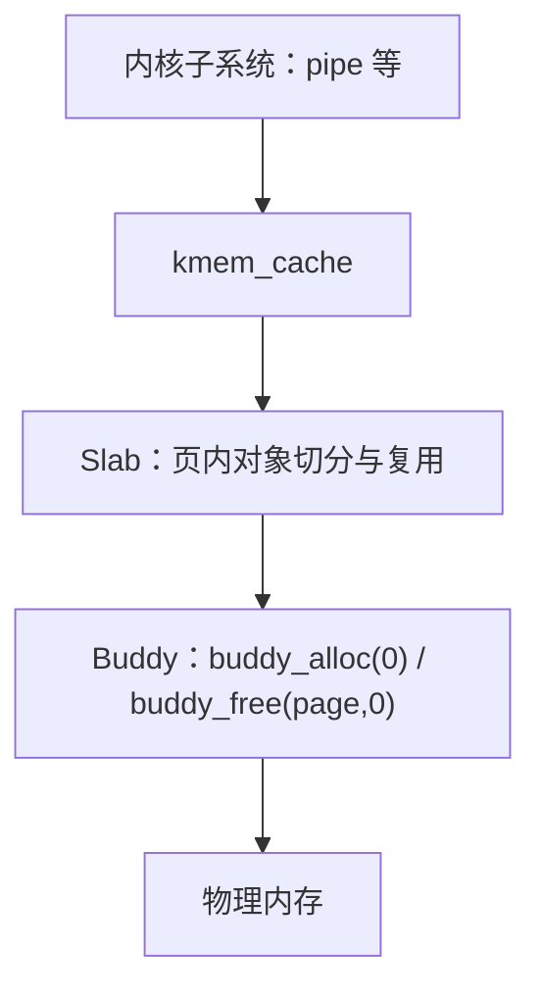

# xv6 Slab 实现与验证指南

> 面向阅读、评审与学习记录
>
> 分支：`slab-dev`（自 `mm-buddy-slab` 的 Buddy 基线 `6eb4dad` 创建，冻结标签 `buddy-v1`）
>
> 范围：在已完成并测试的 Buddy 分配器之上实现教学型 Slab，并把 `struct pipe` 迁移为首个真实使用者

## 0. 实现速览

| 项目 | 内容 |
|---|---|
| 基线 | `buddy-v1` = `6eb4dad`（Buddy 实现 + 测试文档） |
| 开发分支 | `slab-dev` |
| 提交 | `99ef4f3` mm: add slab allocator core with checks and selftests<br>`453db5a` mm: reclaim empty slabs when the cache is idle<br>`5301054` ipc: allocate pipe objects from a slab cache |
| 修改文件 | 新增 [`kernel/slab.c`](kernel/slab.c)；修改 [`kernel/defs.h`](kernel/defs.h#L70-L81)、[`kernel/main.c`](kernel/main.c#L20)、[`kernel/pipe.c`](kernel/pipe.c#L22-L97)、[`Makefile`](Makefile#L11) |
| 调试宏 | `SLAB_SELFTEST`（T1–T6 自测）、`SLAB_PANIC_CASE=1..5`（预期 panic），生产构建不定义 |
| 页来源 | 仅 `buddy_alloc(0)` / `buddy_free(page, 0)`，未修改 `kalloc.c` |
| 测试结论 | T1–T6 PASS；P1–P5 按预期 panic；pipe 压力 PASS；Buddy D1–D7 PASS；`usertests -q` CPUS=3 ×3 与 CPUS=1 ×1 全部 `ALL TESTS PASSED` |
| 提交状态 | 已 commit 到本地 `slab-dev`，未 push |

## 1. 目标与边界

Slab 是 Buddy 之上的内核对象分配层：Buddy 管页，Slab 管页内小对象。



首版明确不做：NUMA、per-CPU cache、后台回收线程、constructor/destructor、通用 `kmalloc`、动态分配 cache 描述符、迁移 `proc`/`file`/`inode`/`buf`；不修改页表、文件系统格式与系统调用 ABI。

## 2. 分层与锁顺序

固定锁顺序：

```text
cache->lock -> buddy.lock
```

- `slab_grow_locked()` 在持有 cache 锁时调用 [`buddy_alloc(0)`](kernel/kalloc.c#L259)，因此形成上面的顺序。
- 归还页时必须先摘链、清除 magic、释放 cache 锁，再调用 `buddy_free()`；归还后不再访问该页头。
- Buddy 从不调用 Slab，不存在反向依赖。
- `slabinit()` 由 boot CPU 在启动阶段调用一次（[`kernel/main.c:20`](kernel/main.c#L20)）。

## 3. 常量与数据结构

常量见 [`slab.c:12-18`](kernel/slab.c#L12-L18)：

```c
#define KMEM_CACHE_MAX       16
#define KMEM_CACHE_NAME_LEN  16
#define SLAB_MIN_STRIDE      16
#define SLAB_BITMAP_WORDS    4
#define SLAB_MAX_OBJECTS     (SLAB_BITMAP_WORDS * 64)
#define SLAB_MAGIC           0x5A15AB5A15AB5A15ULL
#define SLAB_MAX_PAGES       ((PHYSTOP - KERNBASE) / PGSIZE)
```

三种链表状态（[`slab.c:20-25`](kernel/slab.c#L20-L25)）：`SLAB_FREE`、`SLAB_PARTIAL`、`SLAB_FULL`。每个 slab 一页，页首是 [`struct slab`](kernel/slab.c#L27-L37)，包含 magic、所属 cache、链表指针、页内 freelist、`inuse/total`、状态和 256 位分配位图。

cache 描述符见 [`slab.c:44-62`](kernel/slab.c#L44-L62)：名称、`object_size/stride/align/object_offset/objects_per_slab`、三条 slab 链表、`live_objects` 与 alloc/free/grow/reap/fail 统计。描述符来自固定数组 [`caches[16]`](kernel/slab.c#L64)，由 [`caches_lock`](kernel/slab.c#L65) 保护创建，避免“用 Slab 分配描述符”的启动递归。

位图的作用：可靠识别重复释放，并让检查器交叉验证 `inuse`、位图与 freelist（[`bitmap_popcount()`](kernel/slab.c#L109)）。

## 4. 页内对象布局

`kmem_cache_create()` 的布局计算（[`slab.c:367-425`](kernel/slab.c#L367-L425)）：

```c
  sz = object_size < SLAB_MIN_STRIDE ? SLAB_MIN_STRIDE : object_size;
  if (align_up_checked(sz, align, &stride) != 0)
    return 0;
  if (align_up_checked(sizeof(struct slab), align, &offset) != 0)
    return 0;
  if (offset >= PGSIZE)
    return 0;
  count = (PGSIZE - offset) / stride;
  if (count > SLAB_MAX_OBJECTS)
    count = SLAB_MAX_OBJECTS;
  if (count == 0)
    return 0;
  if ((uint64)offset + (uint64)stride * count > PGSIZE)
    return 0;
```

规则：`align == 0` 或小于指针宽度时提升为指针宽度；必须是 2 的幂且不超过 `PGSIZE`；`stride = align_up(max(object_size, 16), align)`；对象区不越界且至少一个对象；失败不占用描述符槽。

实际 pipe cache 的布局（调试构建 `kmem_cache_dump` 输出）：

```text
slab pipe: size 552 stride 552 align 8 off 88 per-slab 7
```

即 `sizeof(struct pipe)=552`，每页 7 个对象，而迁移前每个 pipe 独占一页。

## 5. 核心实现

### 5.1 slabinit

[`slab.c:340-365`](kernel/slab.c#L340-L365)：初始化 `caches_lock` 与 16 个槽，置 `slab_ready`，随后按需运行自测或 panic 用例。只允许 boot CPU 调用。

### 5.2 slab 增长

[`slab_grow_locked()`](kernel/slab.c#L204-L239)：持 cache 锁调用 `buddy_alloc(0)`；失败 `nr_fail++`；整页先清零再初始化页头，按 `object_offset + i*stride` 从尾到头串出页内 freelist，加入 `free` 链并 `nr_grow++`。freelist 节点就是空闲对象槽本身。

### 5.3 对象分配

[`kmem_cache_alloc()`](kernel/slab.c#L427-L474)：拒绝空/未使用/未初始化 cache；优先 `partial.head`，其次 `free.head`，都为空则增长；校验 magic/归属/freelist/`inuse<total`；弹出 freelist 头，计算槽号并置位；`inuse++`、`live_objects++`、`nr_alloc++`；按新占用量迁移到 `PARTIAL` 或 `FULL`；释放锁后用 `0x05` 填满整个 `stride` 并返回。

### 5.4 对象释放与回收

[`kmem_cache_free()`](kernel/slab.c#L476-L537)：空指针 panic；地址必须落在 `[KERNBASE, PHYSTOP)`；按页向下取整得到页头后才在锁内检查 magic/归属/状态；`slab_object_index()` 保证对象恰好是槽首（否则 panic `slab free interior`）；位图 bit 必须为 1（否则 panic `slab free double`）；清位、减计数、`0x01` poison 整个槽后再把槽首作为 freelist next 入链；按占用量迁移。

空 slab 的回收策略：

```c
  for (;;) {
    int idle = cache->partial.count == 0 && cache->full.count == 0;

    if (cache->free.count > 1 || (idle && cache->free.count > 0)) {
      reap = cache->free.head;
      slab_list_del(&cache->free, reap, SLAB_FREE);
      reap->magic = 0;
      cache->nr_reap++;
      release(&cache->lock);
      buddy_free(reap, 0);
      acquire(&cache->lock);
      continue;
    }
    break;
  }
```

- 缓存仍活跃（存在 partial/full slab）时保留一张热空页；
- 当整个 cache 空闲（没有 partial/full）时，归还全部空页，使 Buddy 空闲页计数精确恢复（见第 6 节的原因）。

### 5.5 shrink 与检查器

[`kmem_cache_shrink()`](kernel/slab.c#L540-L564)：循环摘除所有 `SLAB_FREE` slab，锁外逐页 `buddy_free`，返回归还页数；不回收 partial/full。

[`slab_check_locked()`](kernel/slab.c#L311-L337) 及两个辅助（[`slab_check_freelist`](kernel/slab.c#L242-L260)、[`slab_check_list`](kernel/slab.c#L263-L309)）验证：

| 不变量 | 实现位置 |
|---|---|
| 链表无环（节点数上限 `SLAB_MAX_PAGES`） | [`L272`](kernel/slab.c#L272) |
| 页对齐、位于 `[KERNBASE, PHYSTOP)` | [`L274`](kernel/slab.c#L274) |
| magic/cache/state 与所在链一致 | [`L276`](kernel/slab.c#L276) |
| `total == objects_per_slab`、`inuse <= total` | [`L280`](kernel/slab.c#L280) |
| free/partial/full 的 `inuse` 条件与 full 的 freelist 为空 | [`L282-L288`](kernel/slab.c#L282-L288) |
| 位图 popcount == `inuse`，且超出 `total` 的位为 0 | [`L289-L293`](kernel/slab.c#L289-L293) |
| freelist 无环、无重复、槽合法且 bit 为 0、长度 == `total-inuse` | [`slab_check_freelist`](kernel/slab.c#L242-L260) |
| 三链在用对象汇总 == `live_objects`，实际节点数 == `count` | [`L300-L308`](kernel/slab.c#L300-L308) |

[`kmem_cache_check()`](kernel/slab.c#L566-L578) 只加一次锁；[`kmem_cache_dump()`](kernel/slab.c#L580-L596) 在锁内打印布局与统计。

## 6. 回收策略与设计取舍

任务书 §8 第 10 步原义是“free 链超过 1 页时摘除一张空页”，即长期保留一张热空页。实现中先按该策略实现，随后在 `usertests -q` 中观察到：

```text
FAILED -- lost some free pages 32260 (out of 32261)
```

原因是 `usertests` 的 `drivetests()` 会在测试前后用 `sbrk` 统计空闲物理页；`pipe1` 关闭所有 pipe 后，pipe cache 保留的热空页使计数少 1，导致原有测试失败。若维持该策略，则无法满足任务书“`usertests -q` 通过”的验收项。

最终采用的策略兼容两者：

1. cache 活跃时保留一张热空页（任务书默认行为）；
2. cache 完全空闲时归还全部空页（等价于自动 shrink）。

调试构建下的实测统计（pipe 压力后）：

```text
slab pipe: slabs free 0 partial 0 full 0, live 0
slab pipe: alloc 232 free 232 grow 4 reap 4 fail 0
```

`grow == reap`、`alloc == free`、`live == 0`，说明对象与页都完整归还；同时 `usertests` 的空闲页校验通过。该差异已在第 10 节记录。

## 7. pipe 接入

[`kernel/pipe.c`](kernel/pipe.c) 的修改：

- 静态 `pipe_cache` 与初始化（[`L22-L37`](kernel/pipe.c#L22-L37)）：

```c
static struct kmem_cache *pipe_cache;

void
pipeinit(void)
{
  pipe_cache = kmem_cache_create("pipe", sizeof(struct pipe), 0);
  if (pipe_cache == 0)
    panic("pipe cache");
}
```

- `pipealloc()` 用 `kmem_cache_alloc(pipe_cache)` 取代 `kalloc()`（[`L48`](kernel/pipe.c#L48)），bad 路径用同一 cache 释放（[`L67`](kernel/pipe.c#L67)）。
- `pipeclose()` 最终释放改用 `kmem_cache_free(pipe_cache, pi)`（[`L88`](kernel/pipe.c#L88)），锁释放位置、读写唤醒和字段初始化均未改变。
- [`main.c:31`](kernel/main.c#L31) 在 `fileinit()` 之后、任何用户进程启动之前调用 `pipeinit()`。

调试构建下 `pipeclose()` 会在释放后调用 `kmem_cache_check()`，并在跨过多个 slab 且 live 归零时 dump 统计（[`L89-L98`](kernel/pipe.c#L89-L98)）；这段代码由 `#ifdef SLAB_SELFTEST` 保护，生产构建编译掉。

## 8. 自测与预期 panic

自测由 `SLAB_SELFTEST` 保护，在 `slabinit()` 末尾运行（[`slab.c:918-935`](kernel/slab.c#L918-L935)）：

| 用例 | 内容 | 实际输出 |
|---|---|---|
| T1 | 创建参数：合法创建；size 0、非 2 幂对齐、对齐过大、超大对象失败；失败不消耗槽 | `slab: T1 ok` |
| T2 | 64B cache 分配 3 个对象，非空/对齐/互异/写满/释放/计数 | `slab: T2 ok` |
| T3 | 跨 slab（`n+3` 个对象）与状态迁移：full+partial、热页保留、idle 时全部回收 | `slab: T3 ok (62 objects/slab)` |
| T4 | 16/24/64/128/512/1024 字节 6 种 cache，跨页、对齐、边界字节、两两不重叠 | `slab: T4 ok` |
| T5 | 固定种子 xorshift、256 记录槽、5000 次混合分配释放、每 100 次 check | `slab: T5 ok` |
| T6 | 增长多个 slab 后全部释放并 shrink，Buddy 空闲页与 `buddy_check()` 恢复 | `slab: T6 ok` |

预期 panic 由 `SLAB_PANIC_CASE=1..5` 控制，每次启动只跑一个（[`slab.c:937-1004`](kernel/slab.c#L937-L1004)）：

| 用例 | 操作 | 实际 panic 文本 |
|---|---|---|
| P1 | 同一对象释放两次 | `panic: slab free double` |
| P2 | 用错误 cache 释放对象 | `panic: slab free slab` |
| P3 | 释放对象内部地址 | `panic: slab free interior` |
| P4 | 通过 cache 释放原始 Buddy 页 | `panic: slab free slab` |
| P5 | 篡改 slab magic 后释放 | `panic: slab free slab` |

pipe 压力使用临时用户程序 `user/pstress.c`（循环创建关闭、5 个子进程各持 5 个 pipe 制造跨 slab、fork 交叉关闭、读端/写端提前关闭），验证后已从生产 diff 移除。

## 9. 验证记录

### 9.1 环境与命令

- gcc 9.3.0、QEMU 7.2.0；`make clean && make && make fs.img`。
- 自测构建：`make DETFLAGS="-ffile-prefix-map=$(pwd)=. -DSLAB_SELFTEST"`。
- panic 用例：`make DETFLAGS="-ffile-prefix-map=$(pwd)=. -DSLAB_PANIC_CASE=N"`。
- 运行使用 pexpect 脚本 `/tmp/opencode/xv6_run.py`（`XV6_CPUS` 可选）与 `/tmp/opencode/xv6_panic.py`；日志在 `/tmp/opencode/`。

### 9.2 结果

| 验证项 | 结果 | 证据 |
|---|---|---|
| 生产构建（`-Werror`） | PASS | 无 warning/链接错误 |
| 生产二进制无自测路径 | PASS | `strings kernel/kernel \| grep -c 'slab selftest'` = 0 |
| T1–T6 自测 | PASS | `slab: T1..T6 ok`，`all selftests passed, free pages 32538` |
| P1–P5 预期 panic | PASS | 5 个 panic 文本与预期逐字一致 |
| pipe 压力（pstress） | PASS | `pstress: OK`；`grow 4 reap 4`、`live 0` |
| 调试构建 `usertests -q` | PASS | `ALL TESTS PASSED`，每 close 执行 `kmem_cache_check` 无 panic |
| Buddy D1–D7（含 slab 代码） | PASS | `buddy: D1..D7 ok`，`free pages 32474` |
| CPUS=3 冷启动 ×3 `usertests -q` | PASS | 3/3 `ALL TESTS PASSED`，无 panic |
| CPUS=1 冷启动 `usertests -q` | PASS | `ALL TESTS PASSED` |
| shell 管道 `echo hello \| cat` | PASS | 输出 `hello` |
| `cat README \| wc`、`forktest`、`stressfs` | PASS | `fork test OK`，无 panic |
| `git diff --check` | PASS | 无空白错误 |
| 文件系统/页表/用户 ABI | 未修改 | diff 仅内核对齐文件 |

Buddy D6 从纯 Buddy 构建的 32476 页变为 32474 页：`slab.c` 的代码与静态数据使内核 `end` 上移 2 页，属预期。

### 9.3 关键输出片段

```text
slab: T1 ok
slab: T2 ok
slab: T3 ok (62 objects/slab)
slab: T4 ok
slab: T5 ok
slab: T6 ok
slab: all selftests passed, free pages 32538

slab pipe: size 552 stride 552 align 8 off 88 per-slab 7
...
pipe cache with no live pipes:
slab pipe: slabs free 0 partial 0 full 0, live 0
slab pipe: alloc 232 free 232 grow 4 reap 4 fail 0
pstress: OK
...
usertests starting
...
ALL TESTS PASSED
```

## 10. 与任务书的差异

1. **空 slab 回收策略**：任务书 §8 第 10 步要求“free 链超过 1 页时只摘除一张”，实现为“活跃时保留一张热页、完全空闲时全部归还”。原因是前者使 `usertests` 的 `countfree()` 少一页而失败（实测 `lost some free pages 32260 (out of 32261)`），与任务书 §12/§15 的 usertests 验收冲突。
2. **提交拆分**：任务书建议 5 个提交，实际为 3 个功能提交（core+checks+selftests、idle reclaim、pipe 接入）；`mm: add slab consistency checks and debug selftests` 合并进核心提交，因为检查器是核心正确性的一部分。
3. **调试辅助函数**：新增 `kmem_cache_live()`、`kmem_cache_grow_count()` 仅在 `SLAB_SELFTEST` 下编译，供 pipe 调试仪器使用；生产构建不包含。
4. **临时用户压力程序**：`user/pstress.c` 按要求验证后删除，未进入任何提交。

## 11. 复现步骤

```bash
git switch slab-dev
make clean && make && make fs.img          # 生产构建
make qemu                                  # 进入 shell 后执行 usertests -q

# Slab 自测
make clean
make DETFLAGS="-ffile-prefix-map=$(pwd)=. -DSLAB_SELFTEST" && make fs.img
make qemu                                  # 启动即输出 T1-T6

# 预期 panic 用例 N=1..5
make clean
make DETFLAGS="-ffile-prefix-map=$(pwd)=. -DSLAB_PANIC_CASE=N" && make fs.img
make qemu
```

## 12. 参考

- 任务书：[`xv6-slab-agent-task.md`](xv6-slab-agent-task.md)
- 设计计划：[`xv6-slab-migration-plan.md`](xv6-slab-migration-plan.md)
- Slab 实现：[`kernel/slab.c`](kernel/slab.c)
- Buddy 实现：[`kernel/kalloc.c`](kernel/kalloc.c)、[`xv6-buddy-implementation-guide.md`](xv6-buddy-implementation-guide.md)
- pipe 接入：[`kernel/pipe.c`](kernel/pipe.c)、[`kernel/main.c`](kernel/main.c#L20)
- 对外声明：[`kernel/defs.h:70-81`](kernel/defs.h#L70-L81)
