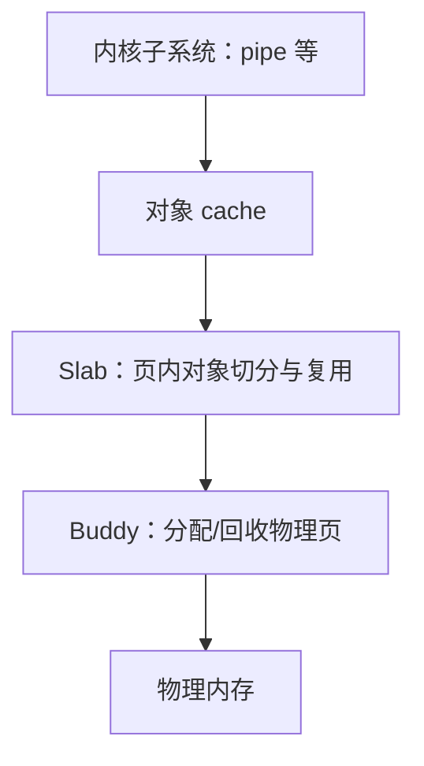
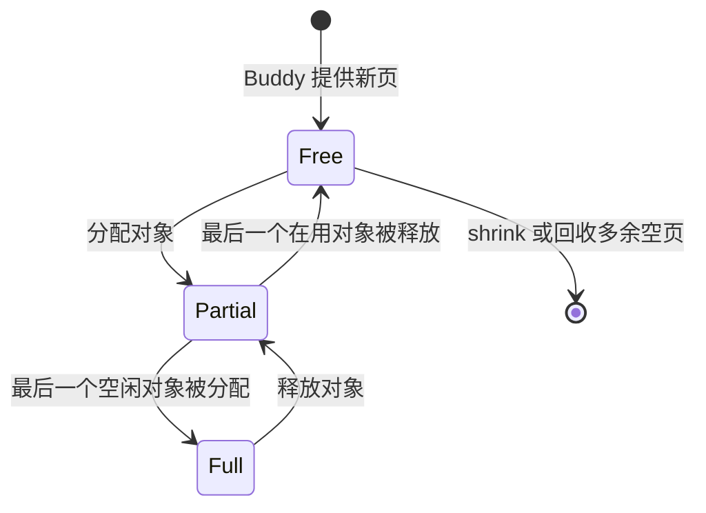

# xv6 Buddy 阶段上的 Slab 移植计划

> 面向阅读、设计评审与学习记录
>
> 目标仓库：`Mina1insky/xv6-riscv`
>
> 基线分支：`mm-buddy-slab`
>
> 编写时基线提交：`49f7fb044189cb9829d262a7e26b208893dc7f1c`
>
> 范围：在已完成并通过测试的 Buddy 分配器上实现教学型 Slab，并以管道对象作为首个真实使用者

## 1. 当前工程状态

当前分支已经把原版 xv6 的单页空闲链表替换为 Buddy：

- `kernel/kalloc.c` 管理 `KERNBASE` 到 `PHYSTOP` 范围内的物理页。
- `buddy_alloc(order)` 分配 `2^order` 个连续页。
- `buddy_free(pa, order)` 释放并合并同阶伙伴块。
- `kalloc()` 与 `kfree()` 继续保持单页接口，分别包装 `buddy_alloc(0)` 与 `buddy_free(pa, 0)`。
- Buddy 已有页状态、空闲页计数、拆分/合并统计与一致性检查。
- Buddy 的公开声明位于 `kernel/defs.h`，初始化入口仍是 `main()` 中的 `kinit()`。

这意味着 Slab 不需要修改页表、用户地址空间或系统调用。它是 Buddy 之上的内核对象分配层：Buddy 管“页”，Slab 管“页内的小对象”。



## 2. 移植目标

首版目标不是逐行复制现代 Linux 的 SLUB，而是复现 Linux slab family 的核心思想：

1. 相同类型或相同大小的对象归入同一个 `kmem_cache`。
2. cache 从 Buddy 申请页，并把页切分为等长对象。
3. 空闲对象在 cache 中复用，避免每个小对象独占 4096 字节。
4. slab 根据占用情况进入 `free`、`partial` 或 `full` 链表。
5. 完全空闲的 slab 可保留一页作为热缓存，也可主动回收到 Buddy。
6. 用锁和一致性检查保证多核下的正确性。
7. 选择 `struct pipe` 做真实接入，验证它不只是孤立的演示分配器。

### 2.1 首版明确不做

- 不实现 NUMA node。
- 不实现每 CPU cache、CPU magazine 或无锁 fast path。
- 不实现内存回收守护线程和 shrinker 框架。
- 不实现对象 constructor/destructor。
- 不实现任意尺寸的通用 `kmalloc(size)`。
- 不动态分配 `kmem_cache` 描述符，以避免“用 Slab 创建 Slab 自身”的启动递归。
- 不把 `proc`、`file`、`inode`、`buf` 等静态表一次性动态化。
- 不修改磁盘格式、文件系统语义、页表或用户态 ABI。

这些能力可以在核心正确后逐步扩展，不能成为首版验收的前置条件。

## 3. 为什么首个使用者选择 pipe

当前 `kernel/pipe.c` 中，`struct pipe` 包含 512 字节数据区以及锁和状态字段；`pipealloc()` 却通过 `kalloc()` 为每个 pipe 分配整整一页，`pipeclose()` 最终用 `kfree()` 释放。

这是理想的 Slab 接入点：

- 对象天然是动态创建和销毁的。
- 对象明显小于一页，能展示内部碎片改善。
- 修改范围局限在 IPC，不需要调整文件系统。
- xv6 的 `usertests`、shell 管道和 `forktest` 能覆盖真实生命周期与并发行为。
- `fileclose()` 在调用 `pipeclose()` 前已经释放文件表锁；`pipeclose()` 也在真正释放对象前释放 pipe 自身的锁，便于保持清晰的锁顺序。

预计一页可容纳多个 pipe；准确数量由 `sizeof(struct pipe)`、Slab 页头大小和对齐计算决定，不在源码中写死。

## 4. 总体设计

### 4.1 一页一个 slab

首版规定每个 slab 固定由 `buddy_alloc(0)` 提供一页。页首放 `struct slab` 元数据，剩余空间切为对象槽：

```text
一页 4096 B
+----------------------+  page base，也就是 struct slab
| slab 元数据          |
| cache / 链表 / 位图  |
+----------------------+  对齐后的 object area
| object 0             |
+----------------------+
| object 1             |
+----------------------+
| ...                  |
+----------------------+
| object N-1           |
+----------------------+
| 尾部不足一个对象空间 |
+----------------------+
```

一页设计让“对象地址反查 slab”非常简单：

```c
slab_base = (uint64)obj & ~(PGSIZE - 1);
```

以后若支持高阶 slab，必须重新设计反查方式，不能继续假设所有对象的 slab 页头都能通过单页向下取整得到。

### 4.2 cache 描述符

每个 `kmem_cache` 至少保存：

- cache 名称。
- 请求对象大小 `object_size`。
- 对齐后的槽大小 `stride`。
- 页内对象区起点 `object_offset`。
- 每页对象数 `objects_per_slab`。
- 一把自旋锁。
- `free`、`partial`、`full` 三条 slab 双向链表。
- slab 数、在用对象数、分配/释放/增长/回收/失败统计。
- 描述符槽是否已使用。

cache 描述符来自固定大小全局数组，例如 `KMEM_CACHE_MAX = 16`，由单独的全局锁保护创建过程。

### 4.3 slab 元数据

每个 slab 页头至少保存：

- magic 值，用于识别非法对象地址。
- 所属 `kmem_cache *`。
- slab 链表的 `next`/`prev`。
- 页内空闲对象链表头。
- `inuse` 与 `total`。
- 当前所属链表类型。
- 分配位图。

空闲对象的前 `sizeof(void *)` 字节保存下一个空闲对象指针。对象槽最小值必须能容纳该指针。

### 4.4 位图与容量

建议用 4 个 `uint64` 形成 256 位固定分配位图：

- bit 为 1：对象已分配。
- bit 为 0：对象空闲。
- 首版将 `objects_per_slab` 限制为不超过 256。
- 将最小 `stride` 设为 16 字节，可使正常页头尺寸下的一页对象数不超过 256。

位图的价值是可靠检测重复释放，并让 `kmem_cache_check()` 可以交叉验证 `inuse`、位图和 freelist，而不依赖对象内容猜测状态。

### 4.5 三类链表状态

| 状态 | 条件 | 分配时 | 释放时 |
|---|---|---|---|
| `free` | `inuse == 0` | 优先级低于 partial；取一个对象后转 partial 或 full | 可保留一页，多余空页回 Buddy |
| `partial` | `0 < inuse < total` | 首选；满后转 full | 若变空转 free |
| `full` | `inuse == total` | 不可分配 | 释放一个对象后转 partial |

状态迁移必须通过统一的链表辅助函数完成，不能在多个路径中手写指针拼接。



## 5. 对外接口

在 `kernel/defs.h` 中前置声明 `struct kmem_cache;`，提供以下最小接口：

```c
void slabinit(void);
struct kmem_cache *kmem_cache_create(char *name, uint object_size, uint align);
void *kmem_cache_alloc(struct kmem_cache *cache);
void kmem_cache_free(struct kmem_cache *cache, void *obj);
uint kmem_cache_shrink(struct kmem_cache *cache);
int kmem_cache_check(struct kmem_cache *cache);
void kmem_cache_dump(struct kmem_cache *cache);
```

语义约定：

- `slabinit()` 在 `kinit()` 之后调用一次。
- `create()` 只创建描述符，不提前向 Buddy 申请页。
- `object_size == 0`、非 2 的幂对齐、对齐过大或一页容不下对象时返回 `0`。
- `align == 0` 按指针宽度对齐；其他对齐至少提升到指针宽度。
- `alloc()` 失败返回 `0`，成功返回满足对齐要求的对象地址。
- `free()` 对空指针、cache 不匹配、非槽首地址和重复释放执行 `panic`，与当前 Buddy 的 fail-fast 风格保持一致。
- `shrink()` 回收该 cache 的所有空 slab，返回交还 Buddy 的页数。
- `check()` 在持有 cache 锁时检查结构不变量，但公开入口不得递归获取同一把锁。

首版不提供 `kmem_cache_destroy()`；固定描述符数量足够 xv6 教学用途，也能减少销毁与并发分配之间的生命周期问题。

## 6. 分配与释放路径

### 6.1 分配

1. 校验 cache。
2. 获取 cache 锁。
3. 优先从 `partial` 取 slab，其次从 `free` 取。
4. 若两者都为空，在持 cache 锁时调用 `buddy_alloc(0)` 增长一个 slab。
5. 初始化页头、位图和页内 freelist，把新 slab 插入 `free`。
6. 从 freelist 弹出一个对象，计算槽序号并设置位图。
7. 增加 `inuse` 和统计，按新占用量迁移 slab 链表。
8. 释放 cache 锁。
9. 用分配 poison（例如 `0x05`）覆盖整个对象槽，再返回对象。

Buddy 本身不会调用 Slab，因此固定采用 `cache.lock -> buddy.lock` 的锁顺序不会形成反向依赖。后续扩展不得让 Buddy 在持锁时调用 Slab。

### 6.2 释放

1. 基于页对齐得到 slab 页首地址。
2. 检查物理地址范围、magic 和 `slab->cache == cache`。
3. 获取 cache 锁后再次检查关键字段。
4. 检查对象位于对象区、偏移是 `stride` 的整数倍、索引小于 `total`。
5. 检查位图对应 bit 为 1，否则视为重复释放。
6. 清位图、减少 `inuse`，用释放 poison（例如 `0x01`）覆盖对象槽。
7. 把对象压回 freelist，并按占用量迁移 slab。
8. 若出现多个空 slab，保留一个热空页，把多余空 slab 从 cache 完全摘除。
9. 释放 cache 锁后再调用 `buddy_free(page, 0)`，避免让已归还页继续暴露在 cache 链表中。

## 7. 文件修改范围

| 文件 | 修改 | 原因 |
|---|---|---|
| `kernel/slab.c` | 新增 | 实现 cache、slab、链表、位图、分配释放、检查与统计 |
| `kernel/defs.h` | 修改 | 增加 Slab 前置声明和公开函数原型；增加 `pipeinit()` |
| `kernel/main.c` | 修改 | 在 `kinit()` 后调用 `slabinit()`，在文件/管道可使用前初始化 pipe cache |
| `kernel/pipe.c` | 修改 | 创建 pipe cache；用 `kmem_cache_alloc/free` 替换整页 `kalloc/kfree` |
| `Makefile` | 修改 | 把 `kernel/slab.o` 加入内核对象列表；支持现有 `DETFLAGS` 注入调试宏 |
| `kernel/slab.h` | 可选新增 | 只放常量或内部共享定义；若仅 `slab.c` 使用则不应新增 |

首版不应修改 `kernel/kalloc.c`、`kernel/vm.c`、文件系统实现、系统调用表或用户 ABI。

## 8. 初始化顺序

推荐顺序：

```c
kinit();       // Buddy 可用
slabinit();    // 初始化 cache 描述符池
kvminit();
...
fileinit();
pipeinit();    // 创建 sizeof(struct pipe) 的 cache
...
userinit();
```

`pipeinit()` 也可以紧跟 `slabinit()`，但放在 `fileinit()` 后更贴近当前 main 的子系统初始化结构。必须保证任何 `pipealloc()` 发生前 cache 已创建。

## 9. 分阶段实施

### 阶段 0：冻结 Buddy 基线

- 确认 `mm-buddy-slab` 工作区干净并记录 HEAD。
- 打 `buddy-v1` 标签或保留 `mm-buddy` 分支。
- 从该提交创建 `slab-dev`。
- 重新执行现有 Buddy 测试，记录 `buddy_free_pages()` 基线。

### 阶段 1：实现 cache 与单页 slab 核心

- 新增 `slab.c`，先只实现固定 cache 描述符池。
- 实现对齐、安全的页内布局计算。
- 实现 slab 三链表与状态迁移。
- 实现 grow、alloc、free、shrink。
- 实现位图和基本统计。
- 此阶段不修改任何真实调用者。

完成条件：内核可启动；内核自测可跨多个 slab 分配对象、乱序释放、回收空页，并恢复 Buddy 空闲页基线。

### 阶段 2：强化检查与故障测试

- 实现 `kmem_cache_check()`。
- 检查链表闭合性、重复节点、状态条件、slab/cache 归属、freelist 长度、位图 popcount 和统计一致性。
- 增加编译期调试自测与单次预期 panic 用例。
- 所有检查代码默认不影响生产启动日志。

### 阶段 3：接入 pipe

- 在 `pipe.c` 中增加静态 `pipe_cache`。
- `pipeinit()` 创建 cache。
- `pipealloc()` 改用 cache 分配。
- 错误清理路径和 `pipeclose()` 改用同一个 cache 释放。
- 保持 pipe 的初始化字段和锁语义不变。

完成条件：shell 管道、并发 pipe、关闭顺序、`forktest`、`stressfs` 和 `usertests -q` 全部通过。

### 阶段 4：统计、文档与收尾

- 输出 pipe cache 的 `object_size/stride/objects_per_slab`、slab 数与对象计数。
- 记录同等数量 pipe 在旧实现与新实现中的 Buddy 页占用差异。
- 移除或编译排除临时自测入口。
- 生产 diff 中不保留测试造成的无关文件系统或用户 ABI 改动。

## 10. 测试计划

### 10.1 构建与回归

```bash
make clean && make && make fs.img
make qemu
```

进入 shell 后至少运行：

```text
echo hello | cat
cat README | wc
forktest
stressfs
usertests -q
```

建议在 `CPUS=1` 和默认 `CPUS=3` 下各运行一轮，并把 `usertests -q` 在三次冷启动中重复执行。

### 10.2 Slab 功能测试

- 创建不同对象尺寸的测试 cache：16、24、64、128、512、1024 字节。
- 验证返回地址对齐。
- 一次分配超过单页容量的对象，强制增长到多个 slab。
- 写满每个已分配对象，验证互不重叠。
- 按顺序、逆序、奇偶交错和确定性伪随机顺序释放。
- 验证 `free -> partial -> full -> partial -> free` 全部状态迁移。
- 调用 `shrink()` 后验证 Buddy 空闲页恢复。
- 在每个阶段调用 `kmem_cache_check()`。

### 10.3 预期 panic 测试

- 同一对象释放两次。
- 用错误 cache 释放对象。
- 释放对象内部地址而不是槽首地址。
- 释放非 Slab 页地址。
- 破坏 magic 或位图后执行检查。

每个 panic 用例单独启动，避免一个预期 panic 阻断其他用例。

### 10.4 pipe 集成测试

- 单 pipe 读写及双端正常关闭。
- 读端先关、写端先关。
- `fork()` 后父子进程交叉关闭描述符。
- 循环创建/销毁大量 pipe，验证 cache 对象数回零。
- 同时保持足够多 pipe 存活，使 cache 跨越多个 slab。
- 测试后执行 `kmem_cache_check(pipe_cache)`；必要时通过仅调试入口 dump 统计。

## 11. 必须维持的不变量

1. 每个 slab 恰好位于 `free/partial/full` 中的一条链表。
2. `inuse == 位图中 1 的数量`。
3. `freelist 节点数 == total - inuse`。
4. freelist 中每个对象属于该 slab、地址对齐且位图为 0。
5. `free` 中所有 slab 的 `inuse == 0`。
6. `partial` 中满足 `0 < inuse < total`。
7. `full` 中满足 `inuse == total` 且 freelist 为空。
8. cache 统计等于遍历所有 slab 得到的汇总。
9. 已交还 Buddy 的页不再出现在任何 cache 链表中。
10. 所有公开分配路径在持锁和锁外部分工一致，不发生同锁递归。

## 12. 风险与规避

| 风险 | 后果 | 规避方式 |
|---|---|---|
| 页内布局未对齐 | 对象地址不满足结构体对齐 | 统一 `ALIGN_UP`，验证 align 为 2 的幂 |
| 对象反查到错误页头 | 任意内存被当作 slab | 物理范围、magic、cache 和槽偏移四重校验 |
| 重复释放 | freelist 成环、重复分配 | 分配位图在入 freelist 前检查并清位 |
| 链表迁移重复插入 | 一个 slab 出现在多条链 | 集中式 `list_del/list_add/slab_move` |
| 持 cache 锁归还后继续访问页 | use-after-free | 先摘链、保存页地址、解锁后 `buddy_free` |
| 初始化递归 | Slab 尚未可用却分配 cache | 固定描述符数组，不用 Slab 分配描述符 |
| pipe 错误路径混用分配器 | Buddy 状态校验 panic | `pipealloc` 与 `pipeclose` 全部成对使用 pipe cache |
| 一次迁移过多子系统 | 难以定位回归 | 先核心自测，再只迁移 pipe |
| 测试只跑单核 | 隐藏竞态 | `CPUS=1` 与 `CPUS=3` 均执行压力回归 |

## 13. 完成标准

- [ ] Buddy 原有专项测试仍全部通过。
- [ ] `slabinit()` 在 Buddy 之后正确初始化。
- [ ] cache 能延迟增长、跨页分配和回收空页。
- [ ] 三类 slab 链表状态迁移正确。
- [ ] 对象地址对齐且不同在用对象不重叠。
- [ ] 位图能阻止重复释放和错误 cache 释放。
- [ ] `kmem_cache_check()` 能验证全部核心不变量。
- [ ] pipe 已完全改为从 pipe cache 分配和释放。
- [ ] pipe cache 一页可容纳多个对象，实际页占用低于一 pipe 一页。
- [ ] `forktest`、`stressfs`、`usertests -q` 通过。
- [ ] 默认生产构建不运行破坏性自测，不产生额外调试噪声。
- [ ] 未修改文件系统格式、页表、系统调用 ABI。
- [ ] 提交按核心、检查、pipe 接入、测试文档分层，便于 bisect。

## 14. 后续可选扩展

首版稳定后，再按以下顺序演进：

1. 增加 `kmalloc` size-class cache（16/32/64/.../2048）。
2. 增加 cache constructor 与 zero-on-alloc 标志。
3. 支持每 CPU 小型 freelist，比较锁竞争。
4. 允许高阶 slab，为接近一页的大对象提高装填率。
5. 研究把固定 `file` 或 `proc` 表动态化，但保留 xv6 的数量上限语义。
6. 比较 Linux SLAB、SLUB 与本实现的数据结构差异。

这些扩展应分别建提交和测试，不能破坏首版的一页 slab 反查假设而不更新校验逻辑。
